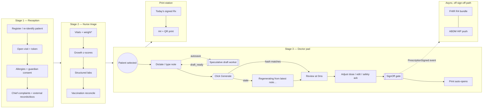
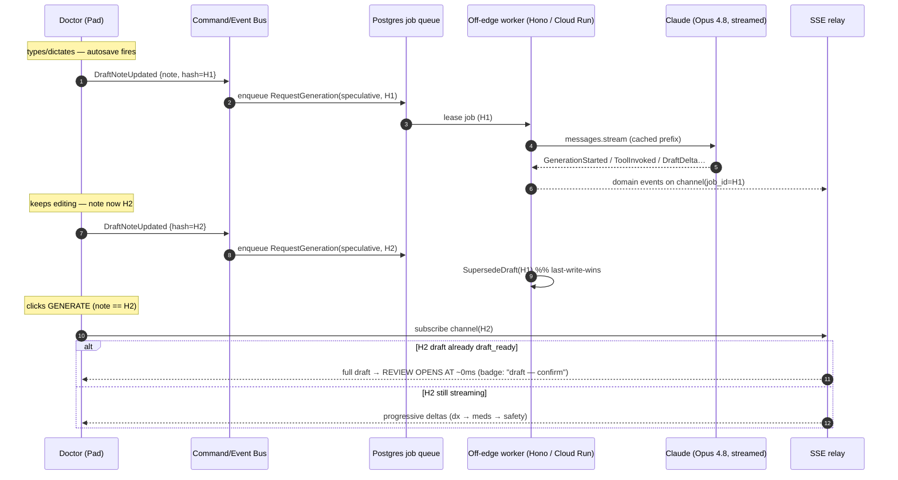

# 01 — User Journeys

> **What this file is.** The end-to-end, screen-by-screen, command-by-command behaviour of the rebuilt pediatric OPD prescription system, written as **target state** — build to this, not to the current `web/` prototype. It is the contract between the clinical workflow and the engineering substrate: every journey step names the **command** it emits, the **event(s)** it produces, the **state** it moves an aggregate to, and the **port** that does the work. If a step here cannot be expressed as a command on the bus, the step is wrong, not the bus.
>
> **What this file is NOT.** It is not the visual design system (that is `03_frontend`), not the schema (that is `05_data`), not the AI orchestration internals (that is `06_ai`). It references those by seam name. It does not re-derive the latency design — it *consumes* it (§3).
>
> **The load-bearing promise.** The doctor's perceived wait to a reviewable prescription is **≈ 0**. We achieve this not by making generation fast, but by making it **already done** before the doctor asks — speculative background generation from the auto-saved note, streamed, off-edge. Everything in §3 exists to honour that one promise. The clinical-safety invariant rides alongside it untouched: **no prescription is ever finalised without a human `SignOff` command** (CS-1 analog for prescribing).

---

## 0. The actors, the bus, and the symmetry axiom

Every journey below is a sequence of **commands** (intent to change state) producing **events** (facts that happened). Reads go through **query objects** against CQRS read models. This is not decoration — it is the seam that lets an AI agent later perform the doctor's actions without a rewrite (digest §9).

| Actor | Stage | Role token (RLS) | Representative commands |
|---|---|---|---|
| **Receptionist** | 1 — Reception | `reception` | `RegisterPatient`, `OpenVisit`, `CaptureAllergies`, `CaptureGuardianConsent`, `EnterExternalRecord`, `UploadDocument` |
| **Nurse** | 2 — Triage | `nurse` | `RecordVitals`, `RecordGrowth`, `EnterLabResult`, `RecordVaccinationGiven`, `ApproveExtraction` |
| **Doctor** | 3 — OPD Pad | `doctor` | `DraftNoteUpdated`, `RequestGeneration`, `AdjustDose`, `AddMedicine`, `OmitMedicine`, `AcknowledgeSafety`, `SignOff` |
| **Print station operator** | 3.5 — Output | `reception` / `service` | `MarkPrinted`, `ReprintRx` |
| **System (speculative worker)** | cross-cutting | `service` | `RequestGeneration(speculative)`, `SupersedeDraft` |
| **Future AI agent** | additive subscriber | `service` (flagged) | `RequestGeneration`, `ProposeSignOff` → still gated by human `SignOff` |

> **Symmetry rule (digest A4 / §9).** `RequestGeneration` is the *same command shape* whether it originates from a doctor's click, the speculative worker's debounce, or a future autonomous agent. The worker cannot tell them apart and must not try. The only asymmetry the system enforces is the **sign-off gate**: a draft is `pending_review` until a human (or, later, an explicitly-flagged autonomous actor under policy) issues `SignOff`. Fail-closed, every path.

---

## 1. Journey map (the whole consult, one diagram)



> `*` **weight is the dosing dependency.** If weight is missing at the doctor's Generate, the pad blocks with a persistent prompt (§4.3, safety UX). Growth, labs, and vaccination reconcile are not blockers — they are context the AI reads through PII-safe tools.

The three stages share **one visit aggregate** and **one patient context**. The boundary between them is a role and a screen, not a data silo: the nurse's `RecordVitals` and the doctor's `RequestGeneration` mutate the same `clinical.visits` row family and are observed by the same event bus.

---

## 2. Stage 1 & 2 — Reception → Nurse (the data that feeds the instant pad)

These two stages are deliberately *not* the headline. Their job is to make the doctor's pad start from a rich, safe, machine-readable context so the speculative draft is good on the first try. Each is summarised as a journey table (step → command → event → port → safety note); record-level field lists live in `05_data`.

### 2.1 Reception journey

| # | Step (operator does) | Command | Event(s) | Port(s) | Decisive rule |
|---|---|---|---|---|---|
| 1 | Search by name / UHID / guardian / phone, or **Scan QR** | `(query)` `FindPatient` | — | `DataAccessPort` | QR payload is **minimal re-registration data only** (UHID, name, DOB, sex initial) — never PHI in a URL. New patient ⇒ step 2; returning ⇒ step 3. |
| 2 | Register new patient (demographics) | `RegisterPatient` | `PatientRegistered` | `DataAccessPort` → server-side UHID | **UHID `RKH-<FY4><MM2><SEQ5>` (regex `^RKH-\d{11}$`) is allocated server-side** under row lock (`clinical.uhid_counter`, `UPDATE … RETURNING`). The client never computes `MAX(seq)+1`. `FY4` is the 4-digit Indian financial-year code (e.g. `2526`). |
| 3 | Open today's visit; capture vitals-intent, token | `OpenVisit` | `VisitOpened` | `DataAccessPort` → server-side `token_no` | Composite identity `(visit_id, patient_id)` is born here and enforced by FK downstream. `token_no` server-allocated, same pattern as UHID. |
| 4 | Capture **known allergies** (text[]) | `CaptureAllergies` | `AllergiesCaptured` | `DataAccessPort` | Allergies are a **first-class safety input** read by the dose engine + AI safety pass. Empty is an explicit choice ("No known allergies" chip), not a blank. |
| 5 | Capture **DPDP guardian consent** (timestamped, plain-language notice, withdrawal path) | `CaptureGuardianConsent` | `GuardianConsentCaptured` | `DataAccessPort` | DPDP 2023 + Rules 2025: ~every patient is a child. This consent is **distinct from the ABDM consent artefact** and is required to proceed. Withdrawal path recorded. |
| 6 | Smart **neonatal** section (auto-shows when DOB < 90d): GA, birth weight, time of birth | `CaptureNeonatalContext` | `NeonatalContextCaptured` | `DataAccessPort` | Chip auto-activates on age < 90d, GA < 37wk, or BW < 2.5kg. Drives corrected-vs-chronological age logic later (computed **client-side**, never by AI). |
| 7 | Chief complaints + vitals-on-arrival (if taken at desk) | `RecordChiefComplaints` | `ChiefComplaintsRecorded` | `DataAccessPort` | Free-text complaints become part of the note context the AI reads. |
| 8 | External records: free-text + **document uploads** (lab reports, imaging, discharge) | `EnterExternalRecord`, `UploadDocument` | `ExternalRecordEntered`, `DocumentUploaded` | `StoragePort` (documents bucket) → Document-Ingestion context | Uploads enter **staged OCR** (`ocr_extractions`), never direct-write to clinical tables. Promotion is a gated nurse action (2.2, step 5). |
| 9 | Returning patient → **AI visit summary** generated | `RequestVisitSummary` | `VisitSummaryRequested` → `VisitSummaryReady` | `GenerationPort` (Haiku tier) | Off-edge, async, **PII-stripped input**. Bounded ~250 words. Stored on `visits.visit_summary`; shown read-only to nurse + doctor. Never confused with the live note. |

**Section order on screen (locked):** Demographics → Visit Details → Chief Complaints → Neonatal → Allergies → Vitals → Vaccination → Labs → Documents.

### 2.2 Nurse triage journey

| # | Step | Command | Event(s) | Port(s) | Decisive rule |
|---|---|---|---|---|---|
| 1 | Record vitals: weight, height, HC, MUAC, temp, HR, RR, SpO₂ (BP if applicable) | `RecordVitals` | `VitalsRecorded` | `DataAccessPort` | **Weight is the dosing dependency.** CHECK constraints on medical ranges at write. Optimistic lock (`version`) → 409 on concurrent edit. |
| 2 | Growth z-scores (WAZ/HAZ/WHZ/HCZ) | `RecordGrowth` | `GrowthRecorded` | `GrowthEnginePort` (deterministic) | Z-scores are computed by a **sealed deterministic engine** (same source-of-truth discipline as dosing). AI does no growth arithmetic. Preterm ⇒ corrected age, computed client-side. |
| 3 | Structured labs (39-test pediatric panel, 4 categories: Hematology, Biochemistry, Microbiology, Imaging) | `EnterLabResult` | `LabResultEntered` | `DataAccessPort` | Auto-unit + auto-flag on entry; LOINC code attached per test (`catalog.concepts` FK). Returning patients see prior results as read-only pills. |
| 4 | Vaccination reconcile: IAP (13 milestones, birth–12yr) **or** NHM-UIP — mutually exclusive | `RecordVaccinationGiven` | `VaccinationGivenRecorded` | `DataAccessPort` | Age-based display; pre-checks existing records; **OVERDUE** labels. Haryana: PCV + Rotavirus free, no JE. Neither schedule pre-selected. |
| 5 | Review staged document extractions → **approve / reject** | `ApproveExtraction` / `RejectExtraction` | `ExtractionApproved` / `ExtractionRejected` → `ExtractionPromoted` | Document-Ingestion `promotion.ts` | Promotion is **fail-closed behind a confidence gate** (CS-1 pattern). Only an approved extraction writes to clinical tables. No colour-only status — text + icon. |

**Output of stages 1–2:** a visit whose `raw_dictation` is empty but whose context (allergies, weight, growth, labs, vax, visit summary, promoted docs) is fully populated and **PII-tagged**. This is the substrate the speculative worker and the AI tools read.

---

## 3. The redesigned doctor UX — generation that feels instant

This is the headline. The design goal is brutal and singular: **from the doctor's chair, clicking Generate opens a reviewable prescription with no perceptible wait, and there is never an infinite spinner.** Below is exactly how, and exactly what the doctor sees.

### 3.1 Why the old flow failed (the thing we are deleting)

The prototype ran the Claude tool-use loop **synchronously inside a Supabase Edge Function** capped at a hard **150,000 ms** wall-clock. Generation legitimately took 50–150 s; the function returned **504/546 at exactly 150,000 ms**, and the doctor stared at a rotating cosmetic message array (`["Reading clinical note…", "Fetching formulary data…", …]`) that bore **no relation to actual progress**. Worst case the doctor waited up to ~5 minutes for nothing. We delete this whole path: the synchronous edge call, the cosmetic `msgs[]` rotator, the timeout/budget/fallback workarounds that only existed to survive the edge wall.

### 3.2 The four compounding mechanisms (target state)



**Mechanism 1 — Off-edge persistent worker.** The Claude tool-use loop runs on a long-lived Hono container (**Fly.io/Render** for POC, **Google Cloud Run** 60-min timeout for prod) pulling from a durable **Postgres job queue** (`prescribing.rx_generation_jobs`, the `dis/` `M004` topic/payload/status/attempts/locked_until pattern). This single change kills the 150 s death. Edge functions, if kept at all, only `validate → enqueue → 202` and relay SSE.

**Mechanism 2 — Speculative / background generation.** The note already autosaves (debounced 3 s) to `visits.raw_dictation`. Each meaningful save **and** each section-chip change becomes a `DraftNoteUpdated` command → a debounced worker speculatively (re)generates a draft keyed by a **content hash of `{note, patient_context_version, selected_sections, rx_language}`**. **Last-write-wins:** a newer hash issues `SupersedeDraft` on the in-flight run. By the time the doctor clicks Generate, a fresh `draft_ready` for the *current* hash usually already exists.

**Mechanism 3 — Streaming end-to-end.** The worker uses `client.messages.stream(...)` (SDK `.get_final_message()` for a timeout-protected completion) and emits domain events — `GenerationStarted`, `ToolInvoked`, `DraftDelta`, `GenerationCompleted`, `GenerationFailed` — on a per-job channel. The pad subscribes by `job_id` over **SSE** (Realtime WebSocket was removed for IO cost; SSE or a short-interval status-row poll is the notify channel) and **renders progressively**: provisional diagnosis appears first, medicines stream in one card at a time, safety panel resolves last. Real progress replaces the fake rotator.

**Mechanism 4 — Review-first async UX with hard deadlines.** On Generate, the pad computes the current note hash and asks the `GenerationPort` for its state:

| `GenerationPort` state | What the doctor sees | Action under the hood |
|---|---|---|
| `ready` (hash matches a `draft_ready`) | **Review opens at ~0 ms** with a subtle "draft — confirm" badge | subscribe channel for any trailing delta; no new job |
| `streaming` (hash matches an in-flight job) | Review opens immediately, cards **fill in live** | attach SSE to existing job |
| `stale` (note changed since last speculative run) | Inline "regenerating from your latest note…" then streams | enqueue `RequestGeneration` for current hash; supersede older |
| `idle` (no speculative run yet, e.g. very fast consult) | "Drafting…" with live progress within ~1–2 s of first token | enqueue + stream |
| `error` / `timeout` | **Degraded UI**: Retry · Edit manually · Single-shot — **never an infinite spinner** | AbortController fired; backoff/jitter retry available |

Every request carries an **AbortController**; there is a **hard client deadline** beyond which the UI degrades. The promise is not "always fast" — it is "**always responsive and always honest**."

### 3.3 The clinical-safety invariant (rides through all of §3.2 untouched)

Speculative + streamed + instant-feel does **not** weaken safety. The draft that opens — however it got there — is `draft_ready`/`pending_review`. **No paper, no FHIR, no ABDM push happens until a human `SignOff` command.** The state machine is the spine and invalid transitions throw and are never persisted (digest §9):

```
note_captured → generating → streaming → draft_ready → doctor_editing → signed → printed
                                                   ↘ superseded         ↘ failed
```

Even failure paths route through `transition(state, event)`. Going AI-first later = an additive subscriber that emits `RequestGeneration` + (policy-gated) `SignOff` — **no rewrite**.

### 3.4 The doctor's journey, step by step

| # | Doctor does | What they see | Command / Event | Port |
|---|---|---|---|---|
| 1 | Select patient in combo box (name/UHID/guardian/token) | `<PatientHeaderStrip>` + nurse data + visit summary + `<GrowthTrend>` (trend arrows + WAZ) + `<LabPills>` (flagged) + `<VaxChecklist>` (dose counts) | `(query)` `LoadDoctorContext` | `DataAccessPort` |
| 2 | Re-selecting a **done** patient | Saved signed Rx auto-loads **read-only** | `(query)` `LoadSignedRx` | `DataAccessPort` |
| 3 | Choose **NHM** or **IAP** schedule; toggle section chips (`<SectionChips>`) | chips reflect what the draft will include | `SelectVaxSchedule`, `SetSections` → each bumps the speculative hash | `EventBus` |
| 4 | Type **or dictate** the clinical note (`<DictationPad>`) | live text; voice via dual-engine VAD (AI transcribe primary, Web Speech fallback); **save indicator** in tab bar: "Editing…" → "Saving…" → "✓ Saved HH:MM" → "Save failed" | `DraftNoteUpdated` (debounced; **deduped via command bus — fixes the 3× write**) | `TranscriptionPort`, `DataAccessPort` |
| 5 | (background, invisible) | nothing — or a quiet "draft ready" hint | speculative `RequestGeneration` → `GenerationCompleted` | `GenerationPort` |
| 6 | Click **Generate** | Review opens per the §3.2 state table — **~0 ms when hash matches** | `RequestGeneration` (or attach) | `GenerationPort` |
| 7 | If **weight missing** | **persistent blocking prompt** at Generate (does not auto-dismiss) | guard before enqueue | client guard |
| 8 | Review streamed draft (`<PrescriptionReview>`) | dx → `<MedicineCard>`s (4-row + pictogram) stream in → `<SafetyPanel>` resolves | `(read)` projection of `prescription_drafts` | — |
| 9 | Adjust a dose (`<DoseAdjuster>` slider/radios) | numbers recompute **instantly + deterministically** | `AdjustDose` → engine recompute | `DoseEnginePort` (pure) |
| 10 | Add / omit a medicine | card added; omitted-formulary misses shown as **red stubs** (`renderOmittedStubs`) | `AddMedicine` / `OmitMedicine` | `DoseEnginePort`, `ClinicalKnowledgePort` |
| 11 | Resolve safety | **high severity → Sign disabled until ack checkbox**; moderate → caution banner; inline allergy-safe alternative | `AcknowledgeSafety` | `SafetyPanel` + `applySignoffGate()` |
| 12 | **Sign off** (`<SignoffGate>`) | gate re-applies after *any* edit (high→edit→save can't bypass); vaccinations `given_today` saved | `SignOff` → `PrescriptionSigned` | `DataAccessPort` |
| 13 | Print | A4 print **auto-opens** via the single canonical `<PrintDocument>` | `MarkPrinted` (on print) | `PrintPort` |

**Dose separation, restated as a journey law (digest §6, A5).** The AI proposes drug + regimen with **no numeric fields**. The pure `DoseEnginePort` recomputes every mg/ml/drops from concentration + band + weight/BSA, rebuilds the R2 English + R3 Devanagari strings + the pictogram, and applies per-ingredient max-single/max-daily caps. The server re-checks **byte-for-byte** (no tolerance — a 20% client override is rejected); any mismatch flags **`REVIEW REQUIRED`**. When the doctor drags the dose slider, the recompute is local, instant, and from the same engine — the AI is never re-invoked for arithmetic.

**Provenance UX (NABH + trust).** AI-generated lines are visually distinguished from clinician edits; the printed Rx carries an **"AI-assisted, doctor-reviewed"** line. Pictograms are **never icon-only** — every icon pairs with Hindi + English text (false-confidence risk).

### 3.5 The voice-dictation sub-journey

Dictation is a first-class input behind `TranscriptionPort` (dual-engine VAD): **AI transcribe primary**, **Web Speech fallback** (sticky — once AI fails in a session, stay on Web Speech). Client-side VAD (energy threshold tuned for OPD ambient noise) skips silence, holds a persistent mic stream, and only sends blobs above a minimum size on a natural pause or a max-chunk timeout. Each settled transcript chunk appends to the note → fires the **same** `DraftNoteUpdated` command as typing → feeds the same speculative engine. Voice and keyboard are indistinguishable to the rest of the system.

---

## 4. The four other journeys (compact, complete)

### 4.1 Print station (`<PrintDocument>` — the single canonical A4 renderer)

The prototype shipped **two** renderers (`printRx` in the pad, `buildRxHtml`/`renderRx` in the output page) that drifted. **Target: one `<PrintDocument>` component**, shared by pad and station, is the sole authority for the A4 layout.

| # | Operator does | Command / query | Port | Rule |
|---|---|---|---|---|
| 1 | Open Print Station | `(query)` `LoadTodaysSignedRx` | `DataAccessPort` | Auto-loads **today's signed** Rx from `prescribing.prescriptions`. RLS-scoped to facility. |
| 2 | Search/filter by patient name / UHID / Rx ID | `(query)` `FindRx` | `DataAccessPort` | `pg_trgm` fuzzy match; read model only. |
| 3 | Print A4 | `MarkPrinted` → `RxPrinted` | `PrintPort` | One renderer ⇒ pad preview == station output, byte-identical. |
| 4 | Reprint | `ReprintRx` → `RxReprinted` | `PrintPort` | Signed Rx is **immutable**; reprint never re-renders from mutable state — it renders the **signed snapshot** (content-hashed for tamper-evidence). |

**Locked A4 layout (preserve exactly):** margins 12mm 10mm; body 12px / line-height 1.5; centred hospital header ("Radhakishan Hospital" + Devanagari + NABH badge), doctor block left, emergency numbers right; info strip (Date · Rx ID · **UHID**); 4-row bilingual medicine block — **R1 GENERIC CAPS (concentration)** / R2 English / R3 Devanagari / R4 inline-SVG pictogram sidebar (sunrise-sun-sunset-moon + dose-qty + food/duration); colour code **blue = meds, red = investigations, black = else**; emergency grid 2 columns; med fonts r1 14px / r2-r3 12px; Noto Sans Devanagari; **inline SVG only — no external images**. The QR carries **no PHI** and is rendered **client-side** (drop `api.qrserver.com`); verification hits a **read-only server endpoint** that checks an **ES256 JWS** signature (replaces the forgeable 6-char client-salt hash).

### 4.2 Patient lookup

| # | Operator does | Command / query | Port | Rule |
|---|---|---|---|---|
| 1 | Search name / UHID / guardian / phone | `(query)` `FindPatient` | `DataAccessPort` | RLS-scoped; read model. Anon key never reaches clinical schemas. |
| 2 | Open patient → timeline | `(query)` `LoadPatientTimeline` | `DataAccessPort` | Visits, prescriptions, labs, growth, vaccinations — all read-only projections. PII shown only to authorised roles. |
| 3 | Hand off to pad (returning patient) | `(query)` `LoadDoctorContext` | `DataAccessPort` | Lookup never mutates; it links into the doctor journey (§3.4 step 1). |

### 4.3 The "weight-missing" and safety-edge journeys (must-not-regress)

Ported verbatim from the prototype's safety UX, re-homed into components:

- **Missing-weight at Generate:** persistent prompt (`<VitalsPanel>` nudge) — generation is **blocked**, not best-effort. Doctor enters weight → speculative hash bumps → instant draft.
- **Preterm age:** corrected (growth/development) vs chronological (vaccinations) ages **pre-computed client-side**; AI receives the resolved ages and does no date math.
- **Sign-off gate re-application:** any edit after a high-severity acknowledgement **re-arms** the gate (high → edit → save cannot silently bypass).
- **Formulary miss:** drug the AI named but the formulary lacks → **red stub**, never a silent drop, never a fabricated dose.

### 4.4 Post-sign-off async journeys (never block the doctor)

`PrescriptionSigned` is an event with **off-sign-off-path** subscribers (digest §7) — the doctor's sign-off and print **never wait** on any of these:

| Subscriber | Trigger | Port(s) | Notes |
|---|---|---|---|
| **FHIR R4 bundle** (OPConsultation, Prescription, DiagnosticReport, ImmunizationRecord) | `PrescriptionSigned` | `FhirCompositionPort` (`NrcesR4Adapter`, pure — takes data, not a DB) | Runs on the worker; FHIR-validator CI gate; `Bundle.signature`. |
| **ABDM HIP push** (M2) | `FhirBundleReady` | `AbdmGatewayPort`, `CryptoBoxPort` (Fidelius), `SignaturePort` | Reliable via `abdm_outbox`; ABHA captured at registration (M1). |
| **Cost/audit ledger** | every `GenerationCompleted` | `DataAccessPort` (`prescription_audit`) | One row per generation attempt (mode, stop_reason, tokens, rounds, tools_called, severity, duration). |

---

## 5. Cross-cutting journey guarantees (the non-functional contract every step inherits)

| Guarantee | How it shows up in journeys | Where enforced |
|---|---|---|
| **Idempotency** | every write step carries an `Idempotency-Key`; double-tap Sign Off ⇒ one prescription | API Gateway (digest §4.1) |
| **Optimistic concurrency** | nurse + doctor editing the same visit ⇒ 409 `VersionConflictError`, not a silent overwrite | `version int` on every mutable row |
| **Correlation** | the whole consult (register → sign → print → FHIR) shares a `correlation_id`; one trace | every command/event/row |
| **Append-only audit** | no journey can delete a clinical/audit row (no DELETE policy); edits → `rx_versions` | RLS + BEFORE UPDATE/DELETE triggers |
| **PII to model = none** | `get_previous_rx` / visit-summary inputs are PII-stripped at a typed boundary | `ClinicalKnowledgePort` adapters |
| **Honest progress** | no journey shows a fake spinner; states are `idle/streaming/ready/stale/error/timeout` | `GenerationPort` contract |
| **a11y** | no colour-only status anywhere (rubber-stamp risk); WCAG 2.2 AA; touch-first on tablet | design-system gate (Lighthouse ≥ 90) |

---

## 6. Journey-level acceptance criteria (the evals these journeys must pass)

These are the behaviour-level gates `09_engineering_discipline` will wire to a runner; this file owns **what** is gated.

1. **Instant-feel:** with a matching speculative `draft_ready`, time from Generate-click to first reviewable content is **< 250 ms** (perceived ~0); with no speculative run, first streamed token renders **< 2 s**; in **no** case is an infinite spinner reachable.
2. **No 150 s death:** generation never runs inside a wall-clock-capped function; a 90 s generation completes and streams to the pad.
3. **Last-write-wins:** editing the note after a speculative run begins always yields a draft for the **latest** hash, never a stale one.
4. **Dose authority:** for a frozen pediatric fixture set, every numeric dose on the rendered draft equals the `DoseEnginePort` output **byte-for-byte**; any AI-proposed number that reaches paper is a test failure.
5. **Sign-off gate:** no path produces a `signed` prescription without a human `SignOff`; high-severity → edit → save cannot bypass the gate.
6. **Single renderer:** pad preview and print-station output for the same Rx are byte-identical.
7. **No PHI leakage:** model inputs across all journeys contain no PII; QR/verification carries no PHI.
8. **Symmetry:** a `RequestGeneration` issued by the speculative worker and one issued by a doctor click produce structurally identical events — proven by the same contract test.

---

### Appendix A — Command / Event glossary (journey subset)

| Command | Emitted by | Resulting event | Aggregate moved |
|---|---|---|---|
| `RegisterPatient` | reception | `PatientRegistered` | patient → active |
| `OpenVisit` | reception | `VisitOpened` | visit → open |
| `CaptureGuardianConsent` | reception | `GuardianConsentCaptured` | consent → granted |
| `RecordVitals` | nurse | `VitalsRecorded` | visit vitals |
| `ApproveExtraction` | nurse | `ExtractionApproved` → `ExtractionPromoted` | extraction → promoted |
| `DraftNoteUpdated` | doctor / voice / worker | `NoteUpdated` | note → captured |
| `RequestGeneration` | doctor / speculative / AI agent | `GenerationStarted` → `…Completed`/`…Failed` | draft → generating/ready |
| `AdjustDose` | doctor | `DoseAdjusted` | medicine line (engine recompute) |
| `AcknowledgeSafety` | doctor | `SafetyAcknowledged` | safety gate |
| `SignOff` | doctor (human-only gate) | `PrescriptionSigned` | prescription → signed (immutable) |
| `MarkPrinted` | station | `RxPrinted` | prescription → printed |

> **Reading note.** Where this file names a port (`GenerationPort`, `DoseEnginePort`, `DataAccessPort`, `ClinicalKnowledgePort`, `TranscriptionPort`, `PrintPort`, `FhirCompositionPort`, `AbdmGatewayPort`), the binding adapter and its `__fake__` peer are specified in `03_frontend`/`04_backend`. A journey step that cannot be expressed against an existing port is a signal to add a port — not to let a component touch a vendor directly.
