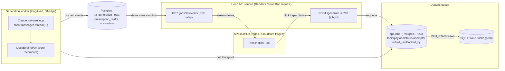
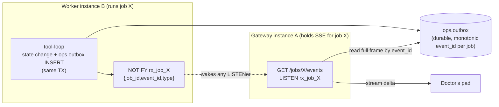
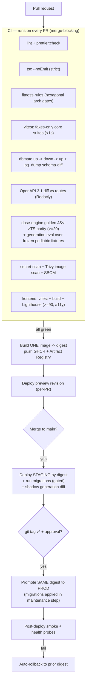

# 07 · Infrastructure, Delivery & CI/CD

> **Target-state rebuild spec.** This document defines the *production-grade* infrastructure, hosting, environments, CI/CD, IaC, secrets, and frontend delivery for the rebuilt Radhakishan Pediatric OPD Rx System. It is decisive: every section names a primary choice, justifies it, lists the alternatives considered, and states the conditions under which we would switch.
>
> Build to **this**, not to the current `web/` (static HTML on GitHub Pages) + Supabase Edge-Function prototype. Where this document and upstream study reports disagree, the [TARGET-ARCHITECTURE DIGEST](../00_overview/digest.md) wins; this file operationalises §1 (off-edge compute) and §8 (secrets/security) of that digest for the delivery plane.
>
> **Scope.** Infrastructure & delivery only: compute/hosting for the off-edge backend, DB hosting, environments, CI/CD pipelines, Infrastructure-as-Code, secrets management, frontend deploy. The TDD/eval *operating model* (review gates, agentic protocol, OpenAPI-as-truth enforcement) is owned by `09_engineering_discipline/`; this file declares **where** those gates run in the pipeline, not how they are authored. AI orchestration internals are in `06_ai/`; ABDM gateway topology is in `07_*`/integrations; this file covers only their deploy/hosting surface.

---

## 0. The drift this rebuild eliminates (why we are doing this)

The prototype's delivery model is the root cause of two production failures and a class of latent ones. We name them so every infrastructure choice below can be traced to a fix.

| # | Prototype reality | Failure it caused / risks | Target fix (section) |
|---|---|---|---|
| D-1 | Generation runs **synchronously inside a Supabase Edge Function** with a hard **150 s wall-clock**. Logs show `504/546 at exactly 150,000 ms`; generation takes 50–150 s. | Doctors wait up to 5 min, then a timeout; no durable record of the in-flight job. | Off-edge long-running compute on a **container platform** (§2) + durable queue (§2.4) + streaming (§6). |
| D-2 | **Hardcoded dated model id** (`claude-*` literal in function source). When a model retired, prod broke with no config lever. | A vendor lifecycle event = a prod outage requiring a code deploy. | Centralized config/secrets (§6) + CI fitness rule `core_no_model_id_literals` (§5.3). |
| D-3 | **Edge-function deploy is manual and out-of-band**: `npx supabase functions deploy <name> --project-ref …` run from a laptop. No build provenance, no environment promotion, no rollback artifact. | Deploy drift: the deployed function diverges from `main`; no audit of who deployed what, when. | Container image is the **single immutable artifact**, built once in CI, promoted by digest across environments (§3, §4). |
| D-4 | **Supabase credentials hardcoded in every HTML page**; anon key reaches the browser and the clinical schema. | Any visitor holds a key into clinical data; no per-role RLS. | Frontend ships **no service keys**; auth via JWT; secrets live server-side in a `SecretsPort` (§6, and `08_security/`). |
| D-5 | **Frontend = 8 single-file HTML pages** pushed straight to GitHub Pages with no build, no tests, no preview environments. | No CI gate on the live app; "deploy" = whatever is in `web/` on `main`. | Vite/TS SPA, built and tested in CI, previewed per-PR, promoted to prod by tag (§7). |
| D-6 | **Schema lives nowhere reproducible** — the prototype ships a `drop table … cascade` monolith DDL. | A re-run wipes data; no migration history; no rollback. | Forward-only **dbmate** migrations with `.rollback.sql`, applied by a gated CI job (§4.4, and `05_database/`). |

**Containment principle (inherited from `dis/portability.md`):** everything we own falls into three layers and **only one changes between Supabase-POC and AWS-prod**: pure **core** (never changes), thin **wiring** (changes once per stack, selected by `RKH_STACK`), and **adapters** (added/removed to match the stack). This is what makes the infrastructure portable by an env flip rather than a rewrite.

---

## 1. Infrastructure principles (load-bearing constraints)

1. **One immutable artifact, promoted by digest.** CI builds exactly one container image per commit. Staging and production run the **same image digest**; nothing is rebuilt per environment. This kills deploy drift (D-3) at the root.
2. **Off-edge compute for anything that calls a model.** No tool-use loop, no FHIR build, no ABDM push runs inside a 150 s-capped function. Edge functions, if kept at all, are thin `validate → enqueue → 202` receivers (digest §1).
3. **Stack portability is a config flip, not a port.** `RKH_STACK=supabase|aws` selects the wiring composition root. CI runs the **same test suite green on both** wirings (fakes-only core suites are stack-agnostic by construction).
4. **Everything reproducible from git.** Infra is declared as code (Terraform), migrations are versioned SQL, the frontend is built from source. No click-ops in production. A laptop is never in the deploy path.
5. **Secrets never touch git, logs, URLs, client bundles, or commit messages.** They are injected at runtime through `SecretsPort`. CI scans for leaks and fails closed.
6. **Fail-fast boot.** Every service validates its full env against the Zod `env.schema.ts` on startup and **refuses to boot** on a missing/invalid var — a misconfigured deploy never serves a request (extends the verified `dis/src/core/env.schema.ts` pattern).
7. **Least privilege, fail closed.** Anon key never reaches a clinical schema; service-role key never reaches a client-reachable surface; a kill-switch returns `503` on writes (ADR-003 pattern).
8. **Data residency: India.** Patient data is child health data under DPDP. All primary compute, DB, and storage are pinned to an **India region** (`asia-south1` / `ap-south-1` / Supabase Mumbai). No PHI in non-India regions, including logs and backups.

---

## 2. Off-edge backend compute & hosting

### 2.1 The decision

| Concern | **POC / pilot (decisive)** | **Production / scale (decisive)** | Why |
|---|---|---|---|
| App runtime | **Render** — one Hono container (Web Service), long-lived, holds SSE | **Google Cloud Run** (region `asia-south1`, Mumbai) | Cloud Run gives a **60-min request timeout** (vs 150 s edge), native scale-to-zero, clean HTTP/2 + SSE, and is the boring managed default. Render is the fastest path to a long-lived SSE-holding container for the pilot. |
| Job worker | Same image, second Render **Background Worker** pulling the Postgres queue | Cloud Run **worker service** (min-instances ≥ 1) pulling SQS | The generation tool-loop must run somewhere that is *not* request-scoped. A separate worker process decouples API latency from model latency. |
| Object storage | Supabase Storage | **GCS** (`asia-south1`) | Behind `StoragePort`; swapped by wiring. |
| Database | Supabase Postgres (Mumbai) | **Cloud SQL for PostgreSQL 16** (`asia-south1`, HA, PITR) | §3. |
| Queue | Postgres queue (`ops.jobs`, `pgmq`-style) | **Cloud Tasks → worker** *or* SQS-by-flip | §2.4. |
| Secrets | Supabase project secrets | **GCP Secret Manager** | §6. |
| Notify / realtime | **SSE** + status-row poll (Realtime WebSocket removed for IO cost) | Same SSE handler; multi-instance fan-out via **`ops.outbox` → Postgres `LISTEN/NOTIFY`** keyed by `job_id` behind `RealtimePort` (§2.5.1) | digest §2.3. |
| Auth | Supabase Auth (JWT) | Supabase Auth (kept) or Cloud Identity Platform | JWT verified server-side; RLS reads claims. |

> **Region note.** The digest names Fly.io/Render (POC) and Cloud Run *or* AWS-by-flip (prod). We pick **Render → Cloud Run** as the primary GCP line because Cloud Run's region menu includes **Mumbai (`asia-south1`)**, satisfying §1.8 residency, and its 60-min timeout + scale-to-zero is the cleanest fit for spiky OPD load with long model calls. **AWS (ECS Fargate + RDS + SQS) is the fully-specified alternative**, reachable by `RKH_STACK=aws` with zero core changes — chosen only if a hospital-group mandate or an existing AWS estate makes it cheaper to operate.

### 2.2 Runtime stack (anchored on `dis/`, verified this session)

```
Node 20 (ESM, strict TS)  ·  Hono ^4.6  +  @hono/node-server ^1.13
postgres (porsager) ^3.4  ·  no ORM  ·  Zod ^4 (env+DTO)  ·  Ajv ^8 (clinical JSON)
pino ^9 (+ correlation-id + PII redactor)  ·  vitest ^2  ·  dbmate ^2.32
@anthropic-ai/sdk (behind ModelPolicyPort)
```

One `Dockerfile`, multi-stage, runs anywhere (Node/Deno/Bun/Lambda-portable via Hono). The `dis/Dockerfile` already scaffolds the multi-stage `node:20-alpine` build → runtime split with non-root `USER node`; we finish it (see §3.1).

### 2.3 Why a container, not edge functions (the headline)

The 150 s edge wall-clock is the **single root flaw** (D-1). A persistent container worker holding the Claude tool-use loop, pulling from a durable queue, kills the `504/546-at-150,000 ms` outright. This is non-negotiable. Concretely:

- **Click `Generate` → API returns `202 {job_id}` in <50 ms.** The work happens off-request.
- **The worker streams** (`client.messages.stream` → `.get_final_message()`) and emits domain events (`GenerationStarted`, `ToolInvoked`, `DraftDelta`, `GenerationCompleted/Failed`) on a per-`job_id` SSE channel.
- **Speculative/background generation** from the auto-saved note (digest §2.2) means the draft usually exists *before* the click — perceived wait ≈ 0.

Every timeout/budget/fallback workaround that existed only to survive the edge wall (the `sprint-2-saved` budget guards) is **deleted** in the rebuild.

> **Edge functions, if kept at all,** are thin signed-webhook receivers (`validate → enqueue → 202`) and SSE relays — *never* the tool-loop host. We keep zero of them at launch and re-introduce one only for an ABDM gateway callback if a signed-webhook receiver with a Supabase-native signature proves simplest.

### 2.4 Job queue & worker topology



- **POC queue = Postgres.** Adopt the verified `dis/` `M004_dis_jobs` pattern: `topic`, `payload jsonb`, `status`, `attempts`, `locked_until`, `locked_by`, with a **partial index on ready jobs** (`WHERE status='queued' AND locked_until < now()`). Claim with `UPDATE … RETURNING` under a row lock (`FOR UPDATE SKIP LOCKED`). This needs no extra infra for the pilot.
- **Prod queue = SQS (AWS) or Cloud Tasks (GCP)**, selected by `RKH_STACK`. The `QueuePort` interface is identical; only the adapter changes. The `dis/` fitness rules already enforce `aws_sdk_only_in_aws_adapters`.
- **Outbox pattern** (`ops.outbox`) for reliable event dispatch: the worker writes events transactionally with the job-state change; a relay drains the outbox to SSE/notify. No lost events on crash.
- **Worker scaling:** POC = 1 always-warm worker. Prod = autoscale on `queue_depth` (Cloud Run min-instances 1, max N; or SQS-driven). Per-job **idempotency key** (UNIQUE on `rx_generation_jobs.idempotency_key`) makes redelivery safe.

### 2.5 SSE / notify hosting note

SSE requires the API instance to hold the connection open. On **Render** this is native (long-lived web service). On **Cloud Run**, SSE works within the 60-min request budget and HTTP/2; set `min-instances ≥ 1` so an SSE relay is always warm and reconnection latency is low. If always-warm WebSocket holders are ever needed, a Fly.io persistent-worker process is the reserved fallback (digest §1). The status-row poll (short interval) is the always-available degraded channel — the UI never shows an infinite spinner (digest §2.4).

### 2.5.1 SSE fan-out under a multi-instance deployment (the load-bearing design)

**The problem holding the connection open does not solve.** In single-process POC, the worker and the API live in one process (or share an in-memory `EventEmitter`), so a worker-produced event reaches the in-process SSE relay for free. **In multi-instance prod that breaks.** On Cloud Run with `min-instances ≥ 1` and `max-instances N`, a doctor's `GET /jobs/:id/events` SSE connection can land on **gateway-instance-A**, while the event it is waiting for is produced by **worker-instance-B**. With no shared bus, instance-A never hears about B's event and the stream silently **stalls** — the worst clinical-UX failure mode (a draft that exists but never streams). So the fan-out must cross process and instance boundaries, durably.

**The seam: one `RealtimePort`, two adapters chosen by env.** The SSE handler code is written **once** against `RealtimePort.subscribe(jobId, onEvent)` and **never changes** between POC and prod — only the adapter the composition root (`wiring/`) picks differs. This is the same env-flip portability invariant as `QueuePort`/`StoragePort` (§1.3): a config selects the implementation, not a rewrite.

| Env | `RealtimePort` adapter | How an event reaches the held SSE connection |
|---|---|---|
| **POC (single process)** | in-memory `StatusChannel` (EventEmitter pub/sub) | Worker emits in-process; the relay in the same process forwards. No cross-instance hop needed. |
| **PROD (multi-instance)** | **Postgres `LISTEN/NOTIFY`, channel keyed by `job_id`, fed by the transactional `ops.outbox`** | Worker writes the domain event to `ops.outbox` **in the same transaction** as the job-state change; a relay (or the worker itself) issues `NOTIFY 'rx_job_<job_id>', '{...}'`; **every** gateway instance holding that job's SSE connection is `LISTEN`ing on that channel and forwards the frame. Any instance can serve any job's stream. |
| **Reserved alternative** | **Redis pub/sub behind the same `RealtimePort`** | Only adopted if Postgres `NOTIFY` fan-out (connection count) or payload-size limits bite at real scale. Swapped by **wiring, not by handler edits** — the SSE handler is identical. |



**Why `LISTEN/NOTIFY` fed by the outbox (the boring, infra-free answer):**

- **No new service.** It reuses the `ops.outbox` the schema already mandates for reliable event dispatch (§2.4) and the Postgres the system already runs — versus standing up and operating Redis/Kafka for the pilot. Boring, well-supported, zero added ops surface.
- **Durable, never-lost.** `ops.outbox` is the single backbone for **both** the live `NOTIFY` *and* the `Last-Event-ID` replay. An event is persisted transactionally before it is notified, so a worker or gateway crash loses nothing; on reconnect the client resumes from `ops.outbox` (events with `id > Last-Event-ID`), then rejoins the live stream — already specified in `04_api/api_contracts.md §5.4`.
- **PII/payload-size safe.** `NOTIFY` carries **only** `{ job_id, event_id, type }` — never PHI, never a large delta. (Postgres `NOTIFY` has an **8 KB** payload limit and is **not** the data plane.) The relay reads the **full frame** from `ops.outbox` by `event_id`. Large `DraftDelta` bodies and any clinical content stay in the durable store, off the notify channel.
- **Total-ordered per job.** `ops.outbox` carries a **monotonic `event_id` per `job_id`** (the SSE `id:` field), so replay and resume are total-ordered within a job and the client can deduplicate idempotently. (Outbox-row ordering is owned by `03_data/schema_design.md`.)
- **Graceful degradation.** If `NOTIFY` is unavailable (e.g. a pooler in transaction mode that does not pass through `LISTEN`), the relay degrades to the **status-row poll** (§2.5) — the always-available channel — so the stream is slow, never dead.

> **One pooling caveat, called out so it is not a surprise.** `LISTEN` requires a **session-pinned** Postgres connection; a transaction-mode pooler (PgBouncer transaction pooling, §3.2) will not deliver async notifications on a pooled connection. The SSE relay therefore holds a **dedicated, session-mode** connection for `LISTEN` (a small fixed pool, one per gateway instance), separate from the transaction-pooled connections the request path uses. This is a wiring detail of the prod `RealtimePort` adapter, invisible to the handler.

---

## 3. Container artifact, image registry & DB hosting

### 3.1 The single build artifact

```dockerfile
# Dockerfile  (finishing the dis/ multi-stage scaffold)
# syntax=docker/dockerfile:1.7

# ---- deps ----
FROM node:20-alpine AS deps
WORKDIR /app
COPY package.json package-lock.json ./
RUN npm ci

# ---- build ----
FROM deps AS build
COPY tsconfig.json ./
COPY src ./src
RUN npm run build            # tsc -> /app/dist

# ---- runtime (distroless-style: alpine + node user) ----
FROM node:20-alpine AS runtime
WORKDIR /app
ENV NODE_ENV=production
COPY package.json package-lock.json ./
RUN npm ci --omit=dev && npm cache clean --force
COPY --from=build /app/dist ./dist
USER node                    # never root
EXPOSE 3000
# one image, two entrypoints chosen by env/command:
#   API:    node dist/http/server.js
#   Worker: node dist/workers/generation.js
CMD ["node", "dist/http/server.js"]
```

- **Both the API and the worker run from the same image**; the platform command selects the entrypoint. One artifact = no drift between request handler and worker.
- **Tagged by immutable digest** (`sha256:…`) plus the git SHA. Environments reference the **digest**, never `:latest`.
- **Registry:** GitHub Container Registry (GHCR) for the source-of-truth image; mirrored/pushed to **Google Artifact Registry** (`asia-south1`) for Cloud Run pulls (region-local pulls = faster cold starts, residency). AWS line uses **ECR** (`ap-south-1`).
- **Provenance:** CI attaches build provenance (SLSA-style attestation) and an SBOM to each image. Trivy scan in CI fails on `HIGH`/`CRITICAL` (§4.3).

### 3.2 Database hosting

| | POC (Supabase) | Production (Cloud SQL Postgres 16) | AWS alt (RDS Postgres 16) |
|---|---|---|---|
| Region | Mumbai | `asia-south1` (Mumbai) | `ap-south-1` (Mumbai) |
| HA | Single instance | **Regional HA** (synchronous standby) | Multi-AZ |
| PITR | Daily auto backup (30 d) | **Continuous WAL / PITR** (35 d) | Continuous PITR (35 d) |
| Connections | PgBouncer (Supabase pooler) | **Cloud SQL connector + PgBouncer sidecar** (transaction pooling) | RDS Proxy |
| Extensions | `pgcrypto`, `pg_trgm`, `pg_stat_statements` | same (all GA on Cloud SQL) | same |
| Access | Private — VPC connector from Cloud Run; **no public IP in prod** | | |

**Driver:** `postgres` (porsager) with parameterized `sql`; no ORM (ADR-006). Schema lives **only** in dbmate migrations. Connection pooling is mandatory in serverless compute (Cloud Run can fan out instances) — use **transaction-mode pooling**; the porsager driver's `max` per instance is set low (e.g. 5) and the pooler absorbs fan-out.

**RLS portability (verified `dis/` `M008` pattern):** RLS policies use `current_setting('app.role' / 'app.doctor_id' / 'app.facility_id')`, set at request start from verified JWT claims. **Identical on Supabase and Cloud SQL/RDS** — no `supabase_auth.uid()` lock-in. The anon key never reaches a clinical schema (D-4 fix). See `05_database/` and `08_security/`.

### 3.3 Object storage & CDN

- Behind `StoragePort` (verified `dis/` interface: `putObject`/`getObject`/`getSignedUploadUrl`/`getSignedDownloadUrl`).
- POC: Supabase Storage (buckets `website`, `prescriptions`, `documents`) with signed URLs.
- Prod: **GCS** (`asia-south1`) fronted by **Cloud CDN**; signed upload URLs so large lab-report/imaging uploads never transit the API. AWS alt: S3 + CloudFront.
- **Forever-retention** (CS-2 spirit) on raw documents and raw model audit payloads; lifecycle rules archive to cold storage but never delete clinical-source artifacts.

---

## 4. Environments & CI/CD pipeline

### 4.1 Environments

| Env | Purpose | Compute | DB | Data | Trigger |
|---|---|---|---|---|---|
| **local** | Dev inner loop | `docker compose` (Hono + Postgres + fake adapters) | ephemeral Postgres | synthetic only | developer |
| **preview** (per-PR) | Review a change in isolation | Cloud Run revision *or* Render preview, tag `pr-<n>` | **branch DB** (Supabase branch / Cloud SQL clone) | seed/synthetic | open/upd PR |
| **staging** | Pre-prod, shadow runs, eval gate | same image digest as prod-candidate | staging Cloud SQL (HA) | de-identified / synthetic, **no real PHI** | merge to `main` |
| **production** | Live OPD | Cloud Run (Mumbai), worker min-1 | prod Cloud SQL (HA, PITR) | real PHI (India-pinned) | **git tag `v*`** + manual approval |

- **No real patient data outside production.** Staging/preview use synthetic data or a de-identified snapshot. This is a DPDP control, enforced by a deploy-time guard that refuses to point a non-prod service at the prod DB.
- **Promotion is by digest, gated by environment protection rules** (GitHub Environments: `production` requires a reviewer approval — the `applySignoffGate` discipline applied to deploys).

### 4.2 Pipeline overview



### 4.3 CI jobs (merge-blocking, extends `dis/` CI)

| Job | What it enforces | Source / pattern |
|---|---|---|
| **Static** | `eslint`, `prettier --check`, `tsc --noEmit` (strict) | `dis/package.json` scripts |
| **Fitness rules** | Hexagonal arch: `core_no_adapter_imports`, `ports_no_adapter_imports`, `core_no_fetch`, `core_no_xhr`, `core_no_sql_literals`, `supabase_sdk_only_in_supabase_adapters`, `aws_sdk_only_in_aws_adapters`, **`core_no_model_id_literals`** (new — bans any `claude-*` / dated model string in business code; the D-2 fix) | `dis/scripts/fitness-rules.json`, extended to all bounded contexts |
| **Unit** | `vitest run` — fakes-only core suites, <1 s, no network/DB | `dis/__fakes__` discipline |
| **Migration round-trip** | `dbmate up → rollback → up`; then `pg_dump` schema-diff vs committed expectation — fails on drift | `dis/scripts/migrate.sh`, `M001–M008` + `.rollback.sql` |
| **OpenAPI-as-truth** | OpenAPI 3.1 diffed against actual Hono routes; breaking diff fails (Redocly `@redocly/cli`) | `dis/openapi.yaml` |
| **Clinical/eval gates** | **dose-engine golden JS↔TS parity (≥20 cases: rounding 0.5 ml/0.1 ml/0.25 tab, caps, bilingual strings)**; generation eval over a **frozen pediatric fixture set** (dosing within rounding rules, NABH fields present, no PII leak, JSON-schema conformance, safety invariants); FHIR R4 snapshot validation | digest §6/§10; runner owned by `09_engineering_discipline/` |
| **Security** | secret-scan (gitleaks) on diff; **Trivy** image scan (fail `HIGH`/`CRITICAL`); SBOM (CycloneDX) attached | §6, §1.5 |
| **Frontend** | `vitest` (components/ports), `vite build`, **Lighthouse CI ≥ 90 incl. a11y (WCAG 2.2 AA)** | digest §3 |

> Stack matrix: the integration suite runs **twice** — `RKH_STACK=supabase` and `RKH_STACK=aws` (against Localstack/Testcontainers) — proving the wiring flip is real, not aspirational.

### 4.4 Migrations in the pipeline (forward-only, gated)

- **CI** *verifies* migrations (up→down→up + schema-diff) but **never applies to a shared environment** — exactly the `dis/scripts/migrate.sh` discipline ("Does NOT apply any migration automatically in CI").
- **Staging** applies migrations automatically on merge (it holds no real PHI).
- **Production** applies migrations as an **explicit, approved maintenance step** within the tagged release, *before* the new image serves traffic, with the kill-switch engaged for writes during the window. Forward-only; every migration ships its `.rollback.sql`. **Never** the prototype's `drop … cascade` monolith.
- The `20260428000000_baseline_from_live.sql` (pg_dump of the live 14-table schema, from `sprint-2-saved`) is the migration baseline; the §5-digest ETL/backfill/cutover migrations layer on top (see `05_database/`).

### 4.5 Deploy strategy & rollback

- **Cloud Run revisions** give immutable, instantly-rollbackable deploys: traffic shifts to the new revision; rollback = shift traffic back to the prior revision (same image digest still resident). **Canary**: 10% → 50% → 100% on prod, gated by error-rate + p95 latency probes.
- **Health probes:** `GET /health` (liveness) and `GET /ready` (readiness — checks DB connectivity + a non-zero `cache_read_input_tokens` warm path). A failing readiness probe holds traffic on the old revision.
- **Auto-rollback** on smoke-test failure or post-deploy error-rate breach.
- **Kill-switch** (`RKH_KILL_SWITCH=true` → `503` on writes) is an env flip, deployable in seconds without a code change (ADR-003 pattern) — the operational circuit-breaker for a clinical-safety incident.

---

## 5. Repository layout & Infrastructure-as-Code

### 5.1 Monorepo (adopt the `dis/` skeleton as the template)

```
/                              # one repo, bounded contexts as modules
├─ apps/
│  ├─ api/                     # Hono server entrypoint (http/server.ts)
│  └─ worker/                  # generation worker entrypoint
├─ src/
│  ├─ core/                    # pure TS — no fetch/fs/SQL/adapter imports (CI-enforced)
│  ├─ ports/                   # interfaces only (the narrow waist)
│  ├─ adapters/                # vendor edge; each has a __fakes__/ peer
│  │  ├─ database/{supabase-postgres,cloudsql-postgres}.ts
│  │  ├─ storage/{supabase-storage,gcs,s3}.ts
│  │  ├─ queue/{pg-queue,cloud-tasks,sqs}.ts
│  │  ├─ secrets/{supabase-secrets,gcp-secret-manager,aws-secrets}.ts
│  │  └─ model/{anthropic,bedrock,vertex}.ts
│  ├─ http/                    # router + middleware + SSE relay (thin)
│  ├─ wiring/                  # the ONLY composition root: supabase.ts | gcp.ts | aws.ts
│  └─ workers/                 # off-edge long-running compute
├─ ui/                         # Vite + TS SPA (frontend)
├─ migrations/                 # dbmate .sql + .rollback.sql (forward-only)
├─ infra/                      # Terraform (IaC) — see §5.2
│  ├─ modules/{cloud_run,cloud_sql,gcs,secret_manager,artifact_registry,monitoring}/
│  ├─ envs/{staging,production}/
│  └─ global/{dns,iam,vpc}/
├─ scripts/                    # migrate.sh, fitness-rules runner, seed scripts
├─ Dockerfile                  # one multi-stage image
├─ docker-compose.yml          # local stack (Hono + Postgres + fakes)
└─ .github/workflows/          # ci.yml, build.yml, deploy.yml, ui-deploy.yml
```

### 5.2 Infrastructure-as-Code: Terraform (decisive)

**Choice: Terraform** (HCL) with a remote state backend in a GCS bucket (`gs://rkh-tfstate`, versioned + object-lock) and state locking. Every cloud resource — Cloud Run services, Cloud SQL instance, GCS buckets, Secret Manager secrets (names/IAM only — *never values*), Artifact Registry, VPC connector, IAM bindings, DNS, monitoring/alerts — is declared in `infra/`.

| Alternative | Verdict |
|---|---|
| **Pulumi** (TS) | Tempting (same language as the app, shares types). Rejected as primary: Terraform's provider maturity for GCP/AWS/Supabase + the "boring, well-supported" default wins for a 2-person ops surface. Revisit only if infra logic grows complex enough to need real loops/conditionals. |
| **Click-ops / gcloud scripts** | Rejected — this *is* the prototype's drift (D-3). No production resource is created by hand. |
| **Supabase dashboard config** | Acceptable for the POC bucket/auth toggles, but the moment we cut to Cloud SQL the topology is Terraform-owned. Supabase project settings that matter (RLS roles, secrets names) are documented as code in `infra/supabase/` even when applied via the management API. |

- **Terraform runs in CI** (`terraform plan` on PR as a comment; `terraform apply` on merge to `main` for staging, on tag for prod) with a service-account identity — **no human applies prod infra from a laptop**.
- **Supabase provider** manages the POC project declaratively where the provider supports it; the rest is documented runbook + management API calls in `infra/supabase/`.
- **Two env folders** (`infra/envs/staging`, `infra/envs/production`) consume shared `modules/` so staging and prod are structurally identical, differing only in sizing/region knobs and the `RKH_STACK` value.

### 5.3 The `core_no_model_id_literals` rule (the D-2 fix, made concrete)

```jsonc
// scripts/fitness-rules.json  (new rule, extends the verified dis/ set)
{
  "name": "core_no_model_id_literals",
  "description": "No dated/model-id string in business code; model ids live only in ModelPolicyPort config",
  "glob": "src/{core,http,workers}/**/*.ts",
  "glob_exclude": ["src/adapters/model/**", "src/wiring/**"],
  "forbidden_pattern": "claude-(opus|sonnet|haiku)-[0-9]",
  "message": "Model ids belong in ModelPolicyPort config, not business code (digest §6, fixes D-2)"
}
```

A model retirement now changes **one config value injected as an env/secret**, deployed by an env flip — never a code change, never a prod outage.

---

## 6. Secrets management & configuration

### 6.1 The `SecretsPort` / `ConfigPort` boundary

```
ConfigPort   -> non-secret runtime config (URLs, region, MODEL id, feature flags, timeouts)
SecretsPort  -> secret material (ANTHROPIC_API_KEY, DB service-role, ABDM client secret, JWS signing key)
```

Both are ports with stack-specific adapters (digest §3/§8). Business code reads config/secrets **only** through these ports — never `process.env` directly outside `env.schema.ts`, never a hardcoded literal.

| Concern | POC (Supabase) | Production (GCP) | AWS alt |
|---|---|---|---|
| App config (non-secret) | env vars (Render dashboard / Supabase) | Cloud Run env vars from Terraform | ECS task def env |
| Secrets store | Supabase project secrets | **GCP Secret Manager** (versioned, IAM-scoped) | AWS Secrets Manager |
| Injection | env at boot | mounted as env via Secret Manager refs (value never in Terraform state or logs) | task-def secret refs |
| Rotation | manual | versioned + scheduled rotation runbook (`key_rotation.md` pattern) | rotation lambda |

### 6.2 Hard rules (CI-enforced, §1.5)

- `ANTHROPIC_API_KEY`, `OPENAI_API_KEY`, DB service-role key, ABDM `CLIENT_SECRET`, the **ES256 JWS signing key** (QR/FHIR signatures) **never** appear in: the client bundle, logs, URLs, error messages, commit messages, or Terraform state.
- **Service-role key never reaches a client-callable surface.** The browser holds, at most, a short-lived user JWT — never a service key (D-4 fix).
- **Fail-fast boot:** the Zod `env.schema.ts` `superRefine` (verified `dis/` pattern) makes stack-conditional secrets *required* — e.g. `SUPABASE_SERVICE_ROLE_KEY` required iff `RKH_STACK=supabase`; `GCP_*` required iff `RKH_STACK=gcp`. A missing secret = boot refusal, not a runtime 500.
- **gitleaks** scans every PR diff; a hit fails the build. Pre-commit hook mirrors it locally.

### 6.3 Centralized env schema (the config single source of truth)

Extends the verified `dis/src/core/env.schema.ts`:

```ts
const stackEnum = z.enum(['supabase', 'gcp', 'aws']);

const base = z.object({
  PORT: z.coerce.number().int().default(3000),
  NODE_ENV: z.enum(['development', 'test', 'production']).default('development'),
  RKH_STACK: stackEnum.default('supabase'),
  RKH_KILL_SWITCH: booleanFromString,            // ADR-003 -> 503 on writes
  RKH_REGION: z.string().default('asia-south1'), // residency guard (§1.8)
  // Model policy — NO dated literal in business code (D-2); ids arrive as config:
  MODEL_RX_GENERATION: z.string().min(1),        // e.g. claude-opus-4-8  (config, not code)
  MODEL_VISIT_SUMMARY: z.string().min(1),
  MODEL_OCR_STRUCTURING: z.string().min(1),
  // Secrets (presence required by stack via superRefine):
  ANTHROPIC_API_KEY: z.string().min(1),
  JWS_SIGNING_KEY_REF: z.string().min(1),        // Secret Manager ref, not the key itself
  SUPABASE_URL: z.string().url().optional(),
  SUPABASE_SERVICE_ROLE_KEY: z.string().min(1).optional(),
  CLOUDSQL_CONNECTION_NAME: z.string().optional(),
  ABDM_CLIENT_ID: z.string().optional(),
  ABDM_CLIENT_SECRET: z.string().optional(),
  ABDM_GATEWAY_URL: z.string().url().optional(),
});
// superRefine: require Supabase/GCP/AWS + ABDM secrets conditionally on RKH_STACK / feature flags.
```

The model ids are **config**, injected per environment — proving the D-2 fix end to end.

---

## 7. Frontend delivery

### 7.1 Build & host

- **Source:** the Vite + TS component SPA (digest §3) replaces the 8 single-file HTML pages and ~21k lines of duplicated inline JS/CSS. No raw `fetch` + anon-key in components; everything goes through client ports (`DataAccessPort`, `GenerationPort`, `ConfigPort`, …).
- **Build:** `vite build` in CI → static, hashed, immutable assets. **The build is gated** by component tests + Lighthouse ≥ 90 (incl. a11y) — the CI gate the prototype never had (D-5).
- **Host (decisive): Cloudflare Pages** as the primary CDN host. **Justification:** per-PR **preview URLs** (which GitHub Pages cannot do), global edge CDN, instant rollback to prior deployments, custom-domain + TLS for `rx.radhakishanhospital.com`, and a build pipeline that runs the Vite build. **Alternatives:**
  - *GitHub Pages (prototype incumbent):* kept as a zero-cost fallback, but it has **no preview environments and no build-time gate** — the exact gap we are closing. Demoted to fallback only.
  - *Cloud Run static / GCS+CDN:* viable and keeps everything in GCP/Mumbai, but adds ops weight for a pure static bundle; chosen only if a single-cloud mandate forbids Cloudflare.
  - *Vercel/Netlify:* equivalent DX; Cloudflare picked for cost + India edge presence + the firewall/WAF in front of a child-data app.
- **Custom domain:** `rx.radhakishanhospital.com` (the existing `web/CNAME`) re-pointed from GitHub Pages to Cloudflare Pages at cutover. DNS is Terraform-managed.

### 7.2 Frontend config & secrets

- The SPA ships **no secrets**. At runtime it reads a **public** config (API base URL, Supabase project URL, *publishable* anon key for auth only, model display name) from a `ConfigPort` populated by a `/config` endpoint or a build-time `import.meta.env` — **never a service-role key, never the Anthropic key** (D-4).
- Auth: user logs in (Supabase Auth / Identity Platform) → short-lived JWT → sent as `Authorization: Bearer` to the API → server sets `app.role`/`app.doctor_id` for RLS. The browser never holds a clinical-schema key.
- **CORS locked** to the Cloudflare-Pages origin(s) — not `*` (digest §4.1).

### 7.3 Frontend CI/CD

```
PR  -> ui:test (vitest) + vite build + Lighthouse>=90 (a11y) -> Cloudflare preview URL
merge to main -> deploy to STAGING UI (staging API base)
git tag v*    -> promote SAME build to PROD UI (prod API base, approval-gated)
```

The frontend is promoted as a versioned artifact alongside the backend tag, so UI and API ship as a matched pair (or are explicitly decoupled via a feature-flag ladder — `ENABLED → SHADOW → OPT_IN_OPERATORS → *`, digest §10).

---

## 8. Observability, DR & cost controls (delivery-plane surface)

These are owned in depth by `09_runbooks/`; here is the deploy-plane contract.

### 8.1 Telemetry (adopt `dis/observability/` stack)

- **Logs:** pino JSON, every line carries `correlation_id`; **PII redactor applied at emit time** (no raw-PHI path to disk). Shipped to **Cloud Logging** (prod) / container stdout (POC). `console.log` is banned in shipped code (fitness-rule-adjacent lint).
- **Traces:** spans `adapter.<port>.<op>`, `core.<stage>`, `http.<method>.<route>`; 100% of errors + `clinical-safety`-tagged, 10% of successes; OTel wire format → Cloud Trace.
- **Metrics:** `GET /admin/metrics` (Prometheus) → Cloud Monitoring. Canonical: `queue_depth`, `rx_generation_latency_ms_p95`, `cache_read_input_tokens` (must be non-zero — prompt-cache health), `cost_micro_inr_total`, `generations_failed_total{reason}`.
- **Alerts → runbooks:** `queue_depth > N` sustained → stuck-jobs; sustained model-adapter 5xx → provider-outage (triggers `ModelPolicyPort` tier-downgrade Opus→Sonnet, digest §6); schema-diff mismatch → migration-incident; daily cost budget exhausted → upload/generation soft-stop with banner.

### 8.2 DR / backup (adopt `dis/dr_and_backup.md` targets)

| | POC (Supabase) | Production (Cloud SQL) |
|---|---|---|
| DB backup | daily auto (30 d) + nightly logical `pg_dump` to `documents` bucket (90 d) | **continuous WAL / PITR (35 d)** + daily logical dump to GCS cold (90 d) |
| Raw model/OCR audit payloads | within DB, quarterly export to storage | GCS `rkh-audit-raw`, **forever (CS-2)** |
| Uploaded documents | Supabase replication | GCS cross-region (India only) replication, forever |
| Config/skill/IaC | git is source of truth | git + Terraform state (versioned) |
| **RTO / RPO** | 4 h / 24 h | **1 h / 5 min (PITR)** |

- **Restore drills quarterly** — restore to a *new* project/instance, run the acceptance + dose-parity suites against it, only then promote. Never restore over live.
- **The only irreplaceable data** is the raw model/OCR audit stream (clinical-decision auditability, NABH + DPDP) — its backup outranks every other recovery objective.

### 8.3 Cost & residency guards

- **Region pin** asserted at boot (`RKH_REGION` + a startup check that the DB/storage endpoints resolve to India) — a misconfigured non-India deploy refuses to serve PHI.
- **Prompt caching** is a cost lever, not just latency: CI asserts the cacheable-prefix discipline (tools→system→messages, breakpoint after the frozen skill prompt) and the metrics dashboard tracks `cache_read_input_tokens` ≥ 0 as a regression alarm (digest §2).
- **Daily AI cost budget** enforced server-side; breach → soft-stop with operator banner + scheduled retry at reset (no silent overspend).

---

## 9. Migration from the prototype's edge-deploy model (contrast & cutover)

| Dimension | Prototype (drift-prone) | Target (this spec) |
|---|---|---|
| Backend deploy | `npx supabase functions deploy` from a laptop, per function, manual | CI builds one image → promotes by **digest** across envs; no laptop in the path |
| Compute limit | hard **150 s** edge wall-clock (causes D-1) | **60-min** request budget (Cloud Run) + off-request worker (no limit) |
| Build provenance | none | SLSA attestation + SBOM + Trivy scan per image |
| Rollback | redeploy old code by hand | shift Cloud Run traffic to prior revision (seconds) |
| Model id | hardcoded literal (causes D-2) | `ModelPolicyPort` config, CI-enforced absent from code |
| Secrets | anon key in every HTML page (D-4) | `SecretsPort`, never client-side; gitleaks-gated |
| Frontend | 8 HTML files → GitHub Pages, no CI (D-5) | Vite SPA, tested + Lighthouse-gated, per-PR previews on Cloudflare Pages |
| Schema | `drop … cascade` monolith (D-6) | forward-only dbmate + `.rollback.sql`, CI round-trip verified |
| Environments | one (prod = whatever is on `main`) | local / preview / staging / production, digest-promoted, approval-gated |
| Infra | click-ops / dashboard | Terraform, plan-on-PR, apply-in-CI |

**Cutover sequence (delivery-plane slice of digest §10):**

1. **Stand up the new stack in parallel** (Terraform: Cloud Run + Cloud SQL + GCS + Secret Manager in `asia-south1`) — zero impact on the live prototype.
2. **Centralize config/secrets first** (`env.schema.ts`, `ModelPolicyPort`) — removes the D-2 failure class even before cutover.
3. **Migrate data** forward-only (baseline → ETL-clean → backfill `legacy` → uuid+UHID → dedupe → reconcile → cutover) per `05_database/`, applied by the gated CI migration job.
4. **Shadow rollout:** run speculative generation on the new off-edge worker in **shadow**, diff against the legacy edge output; feature-flag ladder (`SHADOW → OPT_IN_OPERATORS → *`) with the kill-switch armed.
5. **Frontend cutover:** repoint `rx.radhakishanhospital.com` DNS from GitHub Pages to Cloudflare Pages once the SPA passes its gates.
6. **Decommission** edge functions and the static `web/` pages only after the new stack carries 100% traffic for a soak period, with the old Supabase project retained read-only for the audit/restore window.

---

### Cross-references

- **Digest:** `system-spec/00_overview/digest.md` §1 (off-edge compute), §2 (latency), §3 (frontend), §6 (AI orchestration/model config), §8 (security/secrets), §10 (phased migration).
- **Database hosting/migration internals:** `system-spec/05_database/`.
- **Security/RLS/DPDP controls:** `system-spec/08_security/`.
- **AI orchestration (model policy, caching, streaming):** `system-spec/06_ai/`.
- **TDD/eval operating model (gate authoring):** `system-spec/09_engineering_discipline/`.
- **Foundation patterns:** `origin/feat/dis-plan:dis/` — `Dockerfile`, `scripts/fitness-rules.json`, `scripts/migrate.sh`, `src/core/env.schema.ts`, `02_architecture/portability.md`, `09_runbooks/{dr_and_backup,observability,incident_response}.md`, ADR-003/005/006.
