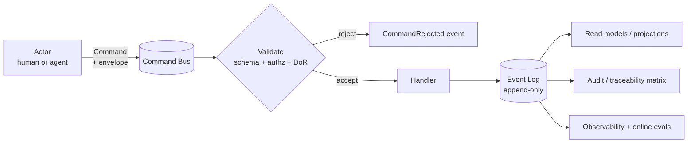
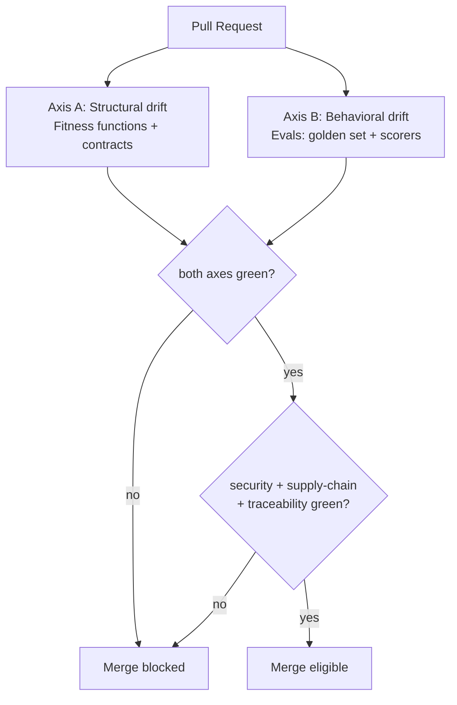
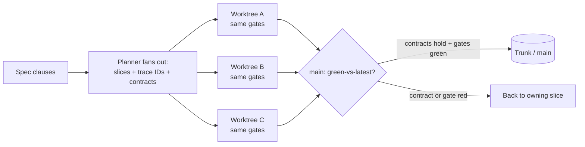
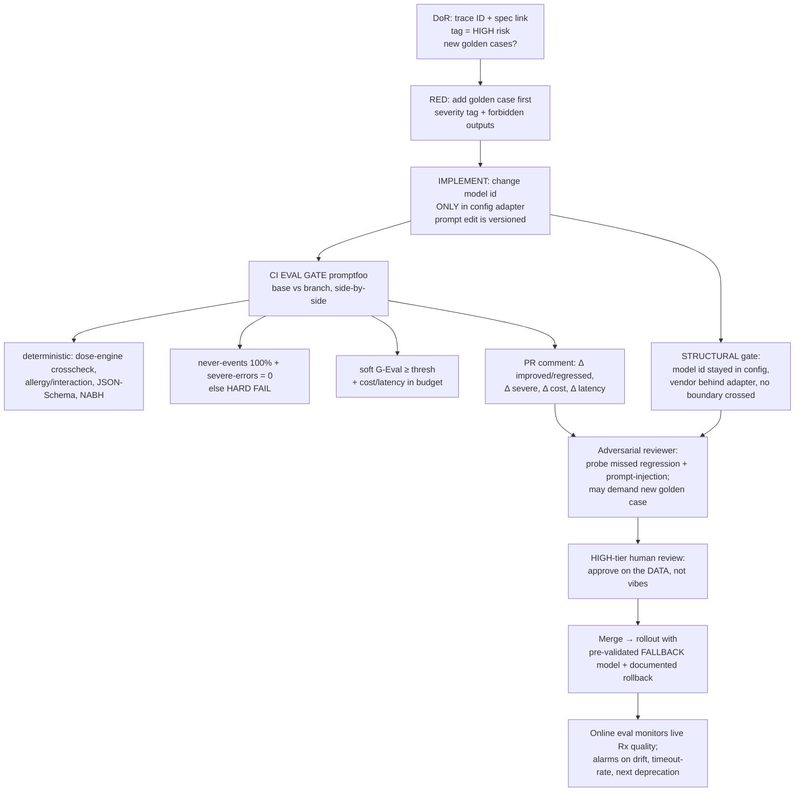

# Agent Operating Model — Engineering Discipline & Evals

> **What this file is.** The end-to-end, spec-**independent** operating model for *how* the rebuild is built by agents and *how every change is proven before it ships*. It defines roles, the per-work-item loop, handoffs, the audit trail, gate contracts, and parallel-agent coordination. It does **not** define the product architecture (authored in parallel, married later by a synthesis pass).
>
> **Authority.** Where this file and the **OPERATING-MODEL DIGEST** disagree, the **digest wins** until amended by an ADR. Downstream discipline files (DoR/DoD, CI, evals, fitness functions, contract tests, observability, supply-chain, scaffolding) must conform to *both* the digest and this file.
>
> **Founding incident this model exists to prevent.** On 2026-06-25 a hardcoded dated Claude model id retired and broke production. The emergency fix swapped models and tuned reasoning effort by **guesswork**, with no eval harness to score the change. This operating model makes that class of incident *structurally impossible*: every model/prompt/code change is scored against a versioned golden eval set, gated on never-events, and shipped with a pre-validated rollback.

---

## 0. The five non-negotiable axioms (inherited by everything below)

| # | Axiom | Operating consequence |
|---|-------|-----------------------|
| 1 | **Done = proven + gated, never declared.** | No actor marks work complete on assertion. "Done" is the output of machine-checkable gates an actor *cannot bypass*. |
| 2 | **Enforce in CI, not in convention.** | Any rule a human or AI could break must **fail a build**, not merely a review comment. |
| 3 | **Answer from data, not guesswork.** | Every model/prompt/code change is scored against a versioned golden eval set before merge. Drift is caught like a regression. |
| 4 | **Humans and AI are symmetric actors.** | Every state-changing action is a **command** on a bus emitting **events**; the audit trail and gates apply identically to both. AI-first later is *additive*. |
| 5 | **The deterministic dose-engine is the dosing source of truth; AI never does arithmetic.** | A tested, CI-enforced architectural boundary — not a guideline. |

These axioms are not aspirational. Each maps to at least one machine gate in §7 (Gate Catalogue). If an axiom has no enforcing gate, that is a defect in this model.

---

## 1. Actors are symmetric — the command/event substrate

The unit of work in this system is a **command** issued by an **actor** (`human` or `agent`), validated, applied, and recorded as one or more **events**. This is the substrate that makes "humans and AI are symmetric" real rather than slogan, and it is what makes the **audit trail** a byproduct of normal operation instead of a bolt-on.



**Every command carries an audit envelope** (see §6). The rule is enforced by a fitness function: *no state change may bypass the bus*, and *every command must carry a valid envelope including `actor`*. The model-retirement incident generalizes here too — a model swap is a **command** (`ChangeModelConfig`), not a silent edit, so it is logged, gated, and reversible like everything else.

> **Why this matters for agents specifically.** When an agent and a human are indistinguishable at the bus boundary, you can dial the human-vs-AI mix per risk tier (§5) without re-plumbing. Going "AI-first" later means routing more commands to agents — not a rewrite.

---

## 2. Roles in the agent build

Roles may be filled by **distinct agents, distinct humans, or a mix** — but they are **distinct responsibilities**, and two of them (Adversarial Reviewer, Verifier) must be **independent** from the actor who wrote the code. Independence is structural: enforced by who can approve which gate, not by good intentions.

| Role | Mandate | Independence rule | Primary outputs | Cannot do |
|------|---------|-------------------|-----------------|-----------|
| **Planner** | Turn a spec clause into tasks with trace IDs, DoR, risk tier (§5), and named eval cases. | — | Task tickets, DoR checklist, risk tag, "new golden cases required: yes/no". | Approve its own DoD. |
| **Builder (Test-author + Implementer)** | Write the **failing test/eval first** (red), then the minimum code to pass (green). Cite which check validates each change. | — | Red commit, green commit, PR with TDD evidence. | Self-attest past gates; review its own slice. |
| **Adversarial Reviewer** | *Try to break the slice*: hunt boundary violations, missing never-event coverage, unsafe dosing assumptions, prompt-injection surfaces, untested edges. Can **demand a new golden case**. | **MUST NOT** be the Builder of the slice. Different agent identity / different human. | Review verdict + concrete counter-examples or "request changes". | Implement the fix and then approve it. |
| **Gatekeeper (CI)** | Run the non-negotiable machine gates. Block merge on any red. | A machine; not bypassable by branch admins on protected `main`. | Pass/fail per gate; PR-comment eval diff. | Be overridden by an actor (admin-override is itself a logged, alarmed event). |
| **Verifier** | Run the **actual flow** — Playwright E2E and/or a live eval run — to confirm *behavior*, not just green unit tests. | **MUST NOT** be the Builder. May be the Adversarial Reviewer or a third actor. | Behavioral evidence (E2E trace, live eval scorecard). | Skip the run and infer from green tests. |

> **Two-person rule for high-risk work (§5):** Builder + (independent) Adversarial Reviewer + (independent) Verifier means no single actor — human *or* agent — can carry a dosing/issuance/PHI/model change from start to merge alone.

### Role-to-gate authority matrix

| Gate | Planner | Builder | Adv. Reviewer | Gatekeeper | Verifier | Human (risk-tier) |
|------|:-:|:-:|:-:|:-:|:-:|:-:|
| DoR satisfied | ✅ author | — | — | ✅ check | — | — |
| Red test exists | — | ✅ author | ✅ verify | ✅ check | — | — |
| Unit/contract/E2E green | — | ✅ | — | ✅ enforce | — | — |
| Fitness functions pass | — | — | ✅ probe | ✅ enforce | — | — |
| Eval gate green | — | — | ✅ probe | ✅ enforce | ✅ live run | ✅ High tier |
| Adversarial review passed | — | — | ✅ verdict | ✅ require | — | — |
| Behavioral verify | — | — | — | — | ✅ | — |
| DoD / merge | — | — | — | ✅ require all | — | ✅ High/Critical |

---

## 3. The per-work-item loop (DoR → DoD)

Orchestrate locally, **verify asynchronously in CI**. This is the canonical loop for **every** vertical slice. No step is skippable; each produces an artifact the next step (and the audit trail) consumes.

```text
 ┌──────────────────────────────────────────────────────────────────────┐
 │  DoR ─▶ RED ─▶ IMPLEMENT ─▶ GREEN ─▶ ADVERSARIAL REVIEW ─▶ GATES (CI)  │
 │                                                     │                  │
 │                                                     ▼                  │
 │                            VERIFY (run it) ─▶ DoD ─▶ MERGE             │
 └──────────────────────────────────────────────────────────────────────┘
        any RED at any stage ──▶ back to the owning step (loop, don't skip)
```

```mermaid
sequenceDiagram
    participant P as Planner
    participant B as Builder
    participant R as Adv. Reviewer (independent)
    participant G as Gatekeeper (CI)
    participant V as Verifier (independent)
    participant H as Human (risk-tier)

    P->>B: Task + trace ID + DoR + risk tier + eval cases
    Note over B: RED — write failing test/eval FIRST
    B->>B: IMPLEMENT minimum to pass
    B->>G: push branch (GREEN locally)
    G-->>B: unit/contract/E2E + fitness + eval gate result
    B->>R: request review (cannot self-review)
    R-->>B: break attempts; request changes / new golden case
    B->>G: address; re-run gates
    G->>V: gates green
    V->>V: run real flow (E2E / live eval)
    V-->>G: behavioral evidence attached
    alt High/Critical risk
        G->>H: request named human approval
        H-->>G: approve on the DATA (eval diff), not vibes
    end
    G->>G: DoD all-green → allow merge
```

### Step contracts (each step has an entry and exit gate)

| Step | Entry condition | Activity | Exit artifact (audited) |
|------|-----------------|----------|--------------------------|
| **DoR** | Task exists with trace ID | Confirm acceptance criteria testable, fitness rules + contracts named, risk tier set, eval cases identified | DoR checklist all ✅ (machine-checked PR template) |
| **RED** | DoR green | Write failing test and/or **new golden eval case** *first*; commit it red | Red commit hash; CI shows the new test failing |
| **IMPLEMENT** | Red commit exists | Minimum code to satisfy the failing test; vendor stays behind adapter; model id only in config | Diff scoped to the slice |
| **GREEN** | Implementation done | Local suite green | Green commit hash |
| **ADVERSARIAL REVIEW** | Green + PR open | Independent actor tries to break it (§2); may demand new golden case | Review verdict + counter-examples or approval |
| **GATES (CI)** | Review requested | All §7 gates run | Per-gate pass/fail; **eval base-vs-branch diff posted to PR** |
| **VERIFY** | Gates green | Run the real flow (E2E / live eval) | Behavioral evidence artifact |
| **DoD** | Verify done | All DoD boxes (§4) machine-checked; human approval if High/Critical | DoD checklist all ✅; merge unblocked |

> **Loop, don't skip.** A red at any step returns control to the owning step. The Gatekeeper does not advance the item; the item advances itself by going green.

---

## 4. DoR / DoD — machine-checkable, not prose

DoR/DoD are encoded as a **PR template + required CI checks + branch protection**. An agent **cannot self-attest past them** — the checkboxes are validated by CI, not honored on trust.

### Definition of Ready (gate to *start* work)

```markdown
## Definition of Ready  (all must be ✅ before RED)
- [ ] Task has a **trace ID** and links to spec clause(s)
- [ ] **Acceptance criteria** are explicit and testable
- [ ] **Fitness rules + contracts** the slice must satisfy are named
- [ ] **Risk tier** assigned (Low / High / Critical — see §5)
- [ ] If LLM-affecting: **eval cases** identified; "new golden cases required: yes/no"
```

### Definition of Done (gate to *merge*)

```markdown
## Definition of Done  (CI-enforced; not self-attestable)
- [ ] Failing test written first, now green (**TDD evidence** in PR: red commit → green commit)
- [ ] All **unit / contract / E2E** suites pass; coverage on safety-critical paths ≥ threshold
- [ ] **Fitness functions** pass (esc()-XSS · no-circular/boundary · dose-engine-only-dosing ·
      sign-off-before-issue · no-secrets/model-id-in-config · vendor-behind-adapter · command-on-bus)
- [ ] **Eval gate** green *if PR touches model/prompt/reference/Rx-schema*:
      never-events 100% pass · severe-error count = 0 · soft-quality ≥ threshold ·
      cost/latency within budget · **base-vs-branch diff posted to PR**
- [ ] **SAST + secret scan + dependency/SBOM** clean; **SRI** present on any new CDN script
- [ ] **Traceability** updated: spec↔task↔code↔test↔eval links resolve
- [ ] **ADR** added if an architectural / canonical-tooling / model-policy decision was made
- [ ] **Adversarial independent-agent review** passed (§2)
- [ ] **Risk-tier human review** obtained where required (§5)
```

**Coverage thresholds (binding defaults; change via ADR):**

| Path class | Line cov | Branch cov | Mutation score |
|------------|:-:|:-:|:-:|
| Dose engine / dosing logic | **100%** | **100%** | ≥ 80% |
| Prescription issuance / sign-off | **95%** | **90%** | ≥ 70% |
| Other domain code | 85% | 75% | — |
| Presentational / UI glue | 60% | — | — |

---

## 5. Risk-based human-in-the-loop routing

The loop is identical for all work; what changes by **risk tier** is *who must approve* and *which gates are mandatory*.

| Risk tier | Triggers | Gate |
|-----------|----------|------|
| **Low** | internal refactor, docs, presentational tweak | automated gates only |
| **High → mandatory human review** | dosing · prescription **issuance** · patient data / PHI · ABDM/FHIR · secrets · **any model / prompt / reference change** | full eval gate **+** named human approver before merge |
| **Critical → explicit confirm even with auto-approve** | delete / force-push / prod / data-drop / schema-destructive | **stop, confirm with a human** (global CLAUDE safety rule) before the action runs |

> **The risk tag is set at DoR and is itself audited.** Mis-tagging is a review-rejectable defect; the Adversarial Reviewer is expected to challenge a too-low tier. A PR labeled `risk:high` that lacks a named human approval is blocked by branch protection — the label drives the required-checks set.

---

## 6. Audit trail & handoffs — the spine of accountability

Every command is logged with a structured envelope; handoffs between roles are themselves recorded events. This is what lets you reconstruct *who (human or agent) did what, why, against which spec clause, and with what evidence* — for any prescription-affecting change, indefinitely.

### Command envelope (logged on every state change)

```jsonc
{
  "command_id": "uuid",
  "type": "ChangeModelConfig | ImplementSlice | ApproveMerge | IssuePrescription | ...",
  "actor": { "kind": "agent" /* | "human" */, "id": "builder-agent-7 | dr.goyal", "session": "..." },
  "trace_id": "RX-DOSE-014",            // links to spec clause + task
  "risk_tier": "high",
  "inputs_digest": "sha256:...",         // hash of inputs, never raw PHI
  "caused_by": "command_id of upstream", // handoff chain
  "emitted_events": ["RedTestAdded", "GatesPassed", "MergeApproved"],
  "evidence": { "eval_run": "braintrust://...", "ci_run": "gh://run/123" },
  "ts": "2026-06-25T10:14:00Z"
}
```

### Handoff protocol (no silent transfers)

| From → To | Trigger event | What must be attached |
|-----------|---------------|------------------------|
| Planner → Builder | `TaskReady` | trace ID, DoR ✅, risk tier, named eval cases |
| Builder → Adv. Reviewer | `ReviewRequested` | red→green commit pair, PR, self-cited validating checks |
| Adv. Reviewer → Builder | `ChangesRequested` | concrete counter-example or required new golden case |
| Builder → Gatekeeper | `GatesRequested` | branch pushed; PR template filled |
| Gatekeeper → Verifier | `GatesPassed` | per-gate results + eval diff |
| Verifier → Gatekeeper | `BehaviorVerified` | E2E trace / live eval scorecard |
| Gatekeeper → Human | `HumanApprovalRequested` | eval base-vs-branch diff (decide on data) |
| Gatekeeper → main | `Merged` | full DoD checklist all ✅ |

**Agent sandboxing for audited safety:** agents that run shell/DB commands operate under **command allowlists + sandboxing + audit logging**; agent-authored code passes **structured-output / schema validation** before it can be merged. A Critical-tier action (delete/force-push/prod/data-drop) **stops and asks a human** even under auto-approve.

---

## 7. Gate catalogue — drift control on two independent axes

Drift is the dominant AI-build failure mode. We block it on **two independent axes**, separately gated; a change must pass **both**. Either alone is insufficient: fitness functions catch *"the agent crossed an architectural boundary"* faster than a human can; evals catch *"the model now gives subtly worse/unsafe prescriptions"* that no structural check can see.



### 7a. Structural drift → architecture **fitness functions** (start with 5, accrete)

Automated tests for the *architecture* that **fail the build** on violation. Begin with the 5 tied to highest patient-safety risk; grow from there.

| # | Fitness function | Enforces | Tooling | Fails build when |
|---|------------------|----------|---------|------------------|
| 1 | **esc()-XSS** | every dynamic `innerHTML =` in `web/**` is `esc()`-wrapped | ESLint flat-config custom rule + AST/grep test | an unescaped dynamic `innerHTML` assignment exists |
| 2 | **no-circular / boundary** | no circular deps; domain ⇏ vendor SDK; cross-context only via published contracts | **dependency-cruiser** | a forbidden edge or cycle appears |
| 3 | **dose-engine-only-dosing** | dosing arithmetic exists **only** in the dose engine; AI/Edge paths call it | dependency-cruiser + AST fitness test | math operators on dose quantities outside the engine |
| 4 | **sign-off-before-issue** | no path issues/prints an Rx without a doctor sign-off event (regulatory firewall) | AST/flow fitness test on issuance paths | an issuance path reachable without a sign-off event |
| 5 | **no-secrets / model-id-in-config** | no secret literal or vendor model id outside the centralized config adapter | grep/AST gate + gitleaks | a model id or secret literal appears elsewhere |
| +6 | **vendor-behind-adapter** | AI model / ABDM / OCR access only via an anti-corruption adapter behind a port | dependency-cruiser | domain imports a vendor SDK directly |
| +7 | **command-on-bus** | state changes flow through the command bus with a valid `actor` envelope | AST fitness test | a write bypasses the bus or omits the envelope |

> These map directly to the digest's enforced principles (SOLID, hexagonal ports/adapters, command bus + CQRS, centralized config, frontend held to the same bar).

### 7b. Behavioral / quality drift → **evals** (versioned golden set + scorers + gates)

The eval gate runs when a PR touches **model / prompt / reference / Rx-schema**. Layers in priority order:

| Layer | Purpose | Blocking? | Tool |
|-------|---------|-----------|------|
| **1. Golden dataset (~30–50 → grows)** | each case = clinical note + patient context (age/weight/allergies/labs) + expected dosing facts + forbidden outputs; **must** include neonates, preterms (corrected vs chronological age), renal/GFR-adjusted, allergy collisions, drug-drug interactions — not just easy AOM | — (the fuel) | version-controlled JSON, strict train/test split |
| **2. Deterministic assertion layer** | JSON-Schema on the Rx contract (4-row format, safety block, NABH block present); **`javascript` assertions that call the real dose engine** and fail if AI numbers disagree; allergy-contraindication; interaction presence; `overall_status` consistency; **cost + latency thresholds** | **YES** | **promptfoo** (Ajv schema + JS asserts) |
| **3. Never-events suite** | ANY occurrence hard-fails CI regardless of aggregate score: exceeds max dose · prescribes a known allergen · missing NABH block | **YES, hard fail** | promptfoo |
| **4. LLM-judge layer (soft quality)** | rubric **G-Eval**: note completeness, Hindi/English clarity, reasoning plausibility. **NEVER used to verify a dose.** Pin judge model; validate vs human labels (Krippendorff α ≈ 0.8); score-averaging; bias-audit (position/length/self-preference) | non-blocking or high threshold | **DeepEval** (pytest, G-Eval) |
| **5. Severity-weighted scorecard** | tag each failure no-harm / mild / moderate / severe; **severe-error count is the headline metric** | severe-error count = 0 is **blocking** | promptfoo + scorecard |

```yaml
# evals/promptfoo.config.yaml  (illustrative — the gate contract, not the product)
description: "Rx-generation golden eval — base-vs-branch diff, gated on never-events"
prompts: [file://prompts/core_prompt.md]
providers:
  - id: anthropic:messages:${MODEL_ID_FROM_CONFIG}   # id resolved ONLY from config adapter
defaultTest:
  assert:
    - type: is-json
      value: file://schemas/prescription.schema.json   # Ajv: 4-row, safety, NABH blocks
    - type: javascript
      value: file://asserts/dose_engine_crosscheck.js   # AI numbers MUST equal dose engine
    - type: javascript
      value: file://asserts/allergy_contraindication.js
    - type: cost
      threshold: 0.05            # USD/case budget — perf budget as an eval assertion
    - type: latency
      threshold: 12000           # ms p-case budget
tests: file://golden/*.case.json   # neonate, preterm, GFR, allergy, interaction edges
```

```bash
# CI eval gate (GitHub Action): base-vs-branch, hard-fail on never-events / severe errors
npx promptfoo@latest eval -c evals/promptfoo.config.yaml \
  --no-cache --share=false \
  | tee eval.out
node evals/gate.js eval.out   # exits 1 if: never-event>0 OR severe-error>0 OR soft<thresh
                              # posts base-vs-branch diff (Δ severe, Δ cost, Δ latency) to PR
```

### 7c. Spec drift → single-source generation + traceability

- **Generated, not hand-synced.** Repo skeleton, contract schemas, and the traceability matrix are **generated from the spec** (scaffolding workflow, §9). A `generated-files-in-sync` CI check fails on hand-edits that diverge from the generator.
- **Traceability spine (IEC-62304-style, right-sized).** Every spec clause, task, source module, test, and eval case carries a **trace ID**. A CI job builds the **spec↔task↔code↔test↔eval matrix** and **fails if any safety-critical spec clause lacks a verifying test/eval**.

```bash
# traceability gate
node tools/build-trace-matrix.js > trace-matrix.json
node tools/check-trace.js trace-matrix.json   # fail: safety-critical clause w/o test|eval
```

### 7d. Security, supply-chain, contracts (per-PR gates)

| Gate | Tool | Blocks merge on |
|------|------|-----------------|
| SAST (general) | **CodeQL** | new high/critical alert |
| SAST (clinical) | **Semgrep** custom PHI/XSS rules | PHI in logs/URLs; un-`esc()` sink |
| Secret scanning | **GitHub secret scanning + push protection**, **gitleaks** | any secret literal in diff/history |
| Dependency / SBOM | **lockfiles committed**, **Renovate** (security auto-merge only, must pass CI), **CycloneDX SBOM**, **SRI** on every CDN `<script>` | unpinned dep; missing SRI; lifecycle scripts enabled |
| Contract tests | **JSON Schema (Ajv)** for Claude tool I/O + Rx output; **Pact-style provider verification** for ABDM FHIR R4 | I/O shape drift at a vendor seam |
| FHIR validation | **HL7 FHIR validator** (ABDM R4 profiles) | invalid bundle against ABDM profile |

> **Model id = a pinned dependency.** A model swap is a **gated change** (eval gate + ADR + rollback), never a hotfix. Renovate/monitoring watches for deprecation; the config adapter is the single firewall where the id may change.

---

## 8. Parallel-agent coordination without drift

Multiple agents build vertical slices **in parallel** without stepping on each other or drifting from the spec. Three mechanisms keep them coherent.

### 8a. Isolation — one git **worktree** per slice

Each vertical slice is built in its **own git worktree**, gated by the **identical** checks. On Windows, follow the **windows-parallel-agents** protocol (worktree isolation + commit hygiene) to prevent cross-agent file leakage and missed commits.

```bash
# one worktree per slice — isolated working dir, shared object store
git worktree add ../wt-rx-stream    feature/rx-stream
git worktree add ../wt-allergy      feature/allergy-guard
git worktree add ../wt-fhir         feature/fhir-bundle
# each agent works ONLY inside its worktree; same CI gates apply to every branch
```

### 8b. Anti-drift coordination rules

| Risk in parallel work | Control |
|-----------------------|---------|
| Two slices edit the same module | **Bounded-context ownership**: each slice owns a context; cross-context changes only via published contracts (fitness-function-enforced). |
| Slices diverge from spec | **Generated skeleton + traceability gate** (§7c): drift from spec is a CI failure, not a merge-time surprise. |
| Contract changes ripple silently | **Contract tests are the seam**: a provider change that breaks a consumer fails the consumer's contract gate. |
| Branches pile up / long-lived | **Trunk-based, ≤3 active branches, short-lived**; merges blocked on red; rebase often. |
| Agent A's file leaks into agent B | **Worktree isolation + commit hygiene** (windows-parallel-agents); never share a working dir. |
| Merge order causes integration breakage | Each branch must be **green against latest `main`** (update-branch + re-run gates) before merge. |

### 8c. Coordination loop



> **Rule of thumb:** parallelism is safe exactly to the degree that slices share **contracts, not internals**. The fitness functions and contract tests are what make "don't share internals" enforceable rather than hoped-for.

---

## 9. Build-execution model — scaffolding-as-workflow, then parallel slices

1. **Scaffolding workflow (spec-synced by construction).** A spec-driven workflow generates the **repo skeleton** — folder structure, ports/adapters, command bus, **CI gates, fitness functions, test + eval harness, DoD gates, contract schemas, traceability matrix** — *from the spec*. The skeleton is correct-by-construction and re-generable; drift from spec is a CI failure (§7c). This is also where the **missing `package.json` / `deno.json` / CI test job** get created — they do not exist today.
2. **Parallel feature workflows in isolated worktrees (§8).** Each vertical slice is gated by the identical checks.
3. **Safe / incremental rollout — not big-bang.** **First slice = move Rx generation off the Edge-Function constraint + streaming generation**, behind the same gates; then expand vertically. The clinical-safety bar (deterministic dose engine + never-events + mandatory physician sign-off) holds at **every** slice.

---

## 10. Worked end-to-end — "answer from data, not guesswork" for a model/prompt change

**Scenario:** an agent must swap the Claude model (the real 2026-06-25 incident) or edit `core_prompt.md`.



| Step | What happens | Why it kills the incident |
|------|--------------|----------------------------|
| DoR | trace ID, spec link, **High** risk tag, eval cases named | the change is now a tracked, gated unit |
| RED | new golden case (severity + forbidden outputs) added **first** | the new failure mode is constrained before code |
| IMPLEMENT | model id changes **only** in config adapter; prompt **versioned** | the model-retirement firewall; reversible by config |
| Eval gate | promptfoo **base-vs-branch**; deterministic + never-events + severe-error = 0 + cost/latency; **diff to PR** | the swap is *scored against data*, not guessed |
| Structural gate | fitness functions confirm id-in-config, vendor-behind-adapter, no boundary crossed | structural drift caught faster than review |
| Adversarial review | independent agent probes for a missed regression + injection | catches what the dataset missed |
| Human review | physician/eng-lead approves on the **data** | High-tier accountability |
| Rollout | ships with **pre-validated fallback model + drilled rollback**; **online eval** monitors live quality and the next deprecation | the incident cannot recur *silently* |

> **Result:** the decision once made by guesswork is now made by a **scored base-vs-branch diff, gated on never-events and severe-error count, with a rollback path.** That is the entire point of the operating model.

---

## 11. Observability, change-management, and runbooks (the runtime half of "proven")

| Concern | Mechanism | Alarm / action |
|---------|-----------|----------------|
| **SLOs + error budgets** on the Rx path | availability, p95 latency, **timeout rate** | error-budget burn → freeze feature merges, fix reliability |
| **In-prod eval-score monitoring** | online eval on live traffic (**Braintrust**, 1M-span tier) | quality drift the golden set didn't predict → alert + "prod miss → golden case" |
| **Model-retirement / deprecation alarm** | monitor vendor model lifecycle; config-adapter pin | alarm well before retirement; pre-validate fallback |
| **Errors** | **Sentry** + Supabase logs/metrics + command-bus event log | severe-error online score breach → page |
| **Change mgmt (PCCP-style)** | prompts **versioned**; allowed prompt/model changes pre-defined; every change eval-validated | each ships with a **documented, drilled rollback** |
| **Incident runbooks** | the founding incident gets a **named runbook**: pre-validated fallback model + rollback drill | rehearsed quarterly |

---

## 12. Honest caveats (carry into every downstream file)

- An eval suite is only as good as its golden set; **v1 is a safety net, not proof of safety** — grow it from production misses.
- **LLM-judge scores drift** when the judge model updates — pin and re-validate against human labels; **never let a judge verify a dose.**
- This is **engineering rigor, not regulatory clearance.** **CDSCO is the binding regulator**; severe-error gating + **mandatory physician sign-off** remain the real safety backstop.
- Start with **5 fitness functions and ~30–50 eval cases** tied to the highest patient-safety risk; let the harness **accrete.** Don't front-load enterprise ceremony — front-load the gates that block harm.

---

## Appendix A — Quick reference: the 8 enforced principles → their gates

| Principle (from digest §2) | Made machine-checkable by |
|----------------------------|----------------------------|
| SOLID / SoC / open-closed / dependency inversion | dependency-cruiser layer rules + ESLint boundaries |
| Hexagonal ports/adapters; anti-corruption layers | fitness fn: domain ⇏ vendor SDK; **vendor-behind-adapter** (§7a #6) |
| Command bus + CQRS; DDD bounded contexts; event-driven | fitness fn: **command-on-bus** (§7a #7); reads/writes separated; cross-context via contracts |
| Centralized config / secrets | **no-secrets / model-id-in-config** (§7a #5) + secret scanning |
| Symmetric actors (human/AI) | command envelope carries `actor`; audit trail identical (§6) |
| Frontend held to the same bar | Vitest/Testing Library; ESLint forbids raw state access + un-`esc()` `innerHTML` (§7a #1) |
| Dose engine = dosing source of truth | **dose-engine-only-dosing** (§7a #3) + deterministic eval cross-check (§7b layer 2) |
| Sign-off before issuance (regulatory firewall) | **sign-off-before-issue** (§7a #4) |

## Appendix B — Required CI checks (branch protection on `main`)

```yaml
# .github/branch-protection (illustrative): required status checks before merge
required_status_checks:
  - unit-tests            # Vitest + deno test
  - contract-tests        # Ajv schemas + Pact provider verification + FHIR validator
  - e2e-critical          # Playwright: print / sign-off flows
  - fitness-functions     # dependency-cruiser + ESLint + AST/grep gates
  - eval-gate             # promptfoo: never-events 100%, severe=0, cost/latency, PR diff
  - sast                  # CodeQL + Semgrep (PHI/XSS)
  - secret-scan           # gitleaks + push protection
  - supply-chain          # lockfile + SBOM + SRI checks
  - traceability          # spec↔task↔code↔test↔eval matrix resolves
required_reviews:
  adversarial_independent: true     # not the Builder
  human_for_high_risk: true         # named approver when risk:high label present
enforce_admins: true                # admin-override is itself a logged, alarmed event
```

---

*End of `09_engineering_discipline/agent_operating_model.md`. Subordinate to the OPERATING-MODEL DIGEST; amend only via ADR.*
