# Quality Gates & CI/CD Pipeline

> **Purpose.** This file is the **enforcement contract** for the agent-built rebuild of the Radhakishan pediatric OPD prescription system. It defines the CI/CD quality-gate pipeline — lint/format, type-check, unit/contract/integration/E2E, architecture fitness functions, EVAL gates, security/dependency/secret scans, coverage, and performance budgets — and states **exactly which gates block MERGE versus DEPLOY**, implemented as **unbypassable machine enforcement** that neither a human nor an AI agent can self-attest past.
>
> **Authority.** This file conforms to the OPERATING-MODEL DIGEST. Where this file and the digest disagree, the **digest wins** until amended by an ADR. This file is **spec-independent**: it constrains *how we prove the build works*, not the target product architecture.
>
> **Founding incident (never again).** On 2026-06-25 a hardcoded, dated Claude model id retired and broke production. The emergency fix swapped models and tuned effort **by guesswork, with no eval harness**. The entire reason this pipeline exists is to make that class of incident *impossible*: every model/prompt/code change is scored against a versioned golden eval set and gated on never-events before it can merge, and ships with a pre-validated rollback.

---

## 0. Axioms this pipeline enforces (inherited, non-negotiable)

| # | Axiom | How CI enforces it |
|---|---|---|
| A1 | **Done = proven + gated, never declared.** | Completion is the output of required status checks + branch protection. No `--no-verify`, no admin override on protected branches, no self-approval. |
| A2 | **Enforce in CI, not in convention.** | Every rule a human/AI could break **fails a build**, not a review comment. |
| A3 | **Answer from data, not guesswork.** | Model/prompt/reference/Rx-schema changes run the **golden eval set** base-vs-branch; never-events hard-fail. |
| A4 | **Humans and AI are symmetric actors.** | Identical required checks regardless of `actor={human\|agent}`; the audit envelope is logged on every command. |
| A5 | **Deterministic dose-engine is the dosing source of truth; AI never does arithmetic.** | A fitness function + an eval assertion that calls the **real dose engine** and fails if AI numbers disagree. |

---

## 1. The two-tier model: MERGE gates vs DEPLOY gates

There are **two enforcement boundaries**. A change crosses them in order; each boundary has its own non-overridable gate set.

```
┌──────────────┐   open PR    ┌─────────────────────────┐   merge to main   ┌──────────────────────────┐
│  worktree /  │ ───────────▶ │   MERGE GATE (PR CI)     │ ────────────────▶ │  DEPLOY GATE (release CI) │
│  feature     │              │  blocks the MERGE button │  (protected main) │  blocks the DEPLOY job    │
│  branch      │              │  required status checks  │                   │  promotion + smoke + roll │
└──────────────┘              └─────────────────────────┘                   └──────────────────────────┘
        │                               │                                              │
        │ pre-commit (advisory,         │ unbypassable, branch-protected               │ environment-protected,
        │ fast local mirror)            │ (no admin override, no self-approve)         │ required reviewers + manual gate for prod
        ▼                               ▼                                              ▼
   format/lint/secrets           full matrix below                        canary → smoke → online-eval watch → promote/rollback
```

**Rule of thumb:**
- **MERGE gates** answer *“is this change correct, safe, in-bounds, and proven?”* — they run on the PR and block the merge.
- **DEPLOY gates** answer *“is it safe to put this in front of patients right now, and can we get it back out fast?”* — they run on `main`/tags and block promotion to production.

A gate that can be satisfied by assertion is not a gate. Every gate below is a **machine check** with a defined pass/fail oracle.

---

## 2. Gate ledger — the complete blocking matrix

Legend: **MERGE** = required PR status check (blocks merge). **DEPLOY** = required release/promote check (blocks production). **Advisory** = runs and reports but does not block (explicitly noted; the default is blocking). **HITL** = additionally requires a named human approver (see §10 risk tiers).

| # | Gate | Tool (canonical) | Blocks MERGE | Blocks DEPLOY | Hard-fail condition |
|---|---|---|---|---|---|
| G1 | **Format** | Prettier / `deno fmt` | ✅ | — | Any file not formatted (`--check` non-zero). |
| G2 | **Lint** | ESLint flat config + `deno lint` | ✅ | — | Any error-level rule; custom clinical rules included. |
| G3 | **Type-check** | `tsc --noEmit`, `deno check` | ✅ | — | Any type error; `// @ts-ignore` without justification comment fails a lint rule. |
| G4 | **Unit tests** | Vitest (frontend/shared), `deno test` (Edge) | ✅ | — | Any failing test. |
| G5 | **Contract tests** | Ajv (JSON-Schema) + Pact-style provider verify + HL7 FHIR validator | ✅ | ✅ (re-run pre-promote) | Any tool I/O, Rx output, or ABDM FHIR R4 contract violation. |
| G6 | **Integration tests** | Vitest/`deno test` against ephemeral Supabase + mocked vendor adapters | ✅ | — | Any cross-module/integration failure. |
| G7 | **E2E (critical paths)** | Playwright | ✅ (critical-path subset) | ✅ (full suite on release) | Sign-off → issue → print flow broken; registration → Rx flow broken. |
| G8 | **Architecture fitness functions** | dependency-cruiser + ESLint custom + AST/grep fitness tests | ✅ | — | Any of the 5+ structural invariants (§5) violated. |
| G9 | **EVAL gate** (golden set) | promptfoo (CI, base-vs-branch) + DeepEval (G-Eval rubrics) | ✅ *(when LLM-affecting; see §6 scope trigger)* | ✅ (release-tag eval run) | **Never-event ≠ 100% pass**, **severe-error count > 0**, soft-quality < threshold, or cost/latency over budget. |
| G10 | **Coverage** | Vitest c8 / `deno coverage` | ✅ | — | Safety-critical paths < threshold (§7); global < floor. |
| G11 | **SAST** | CodeQL + Semgrep (PHI/XSS rules) | ✅ | — | Any high/critical finding; any custom PHI/XSS rule match. |
| G12 | **Secret scan** | GitHub secret scanning + push protection + gitleaks | ✅ | ✅ | Any detected secret / vendor key / model id literal outside config. |
| G13 | **Dependency / supply-chain** | Renovate policy + lockfile-integrity + CycloneDX SBOM + SRI check | ✅ | ✅ | Lockfile drift, missing SRI on a new CDN `<script>`, known-vuln dep, lifecycle-script enabled. |
| G14 | **Performance budgets** | promptfoo cost/latency asserts + Lighthouse CI / size-limit | ✅ | ✅ (p95 latency + timeout-rate smoke) | Rx cost/latency over budget; LCP/bundle over budget. |
| G15 | **Traceability matrix** | generated matrix builder | ✅ | — | Any safety-critical spec clause without a verifying test/eval; generated-files out of sync. |
| G16 | **ADR presence** | `adr-check` (label/path rule) | ✅ *(when architectural/model-policy decision made)* | — | High-tier change with no `docs/adr/NNNN-*.md`. |
| G17 | **Adversarial independent-agent review** | review job + required “independent-review” check | ✅ | — | No independent reviewer attestation event; self-review detected. |
| G18 | **Risk-tier human review** | CODEOWNERS + required reviewers | ✅ (HITL) | ✅ (prod manual gate) | High/Critical tier without named human approver (§10). |
| G19 | **Smoke / canary verification** | Playwright smoke + health probes | — | ✅ | Post-deploy smoke red; canary error/timeout-rate over budget. |
| G20 | **Rollback readiness** | release manifest check | — | ✅ | No pinned previous-good model + no documented rollback for an LLM-affecting release. |

> **Advisory-only exceptions are explicit.** The **LLM-judge soft-quality** sub-score (part of G9) is *non-blocking unless it crosses the configured high threshold* — it is never allowed to verify a dose. Everything else in this ledger is blocking at the stated boundary.

---

## 3. Branch protection — the unbypassability contract

Gates only matter if they cannot be skipped. The following GitHub branch-protection configuration on `main` is itself a reviewed artifact (changes require an ADR + the same approvals). **An agent cannot self-attest past these.**

```yaml
# branch protection (main) — managed as code (e.g. terraform/gh api), reviewed like any change
required_status_checks:
  strict: true                 # branch must be up to date with main before merge
  contexts:                    # ALL must be green — these are the MERGE gates
    - ci/format
    - ci/lint
    - ci/type-check
    - ci/unit
    - ci/contract
    - ci/integration
    - ci/e2e-critical
    - ci/fitness-functions
    - ci/eval-gate            # conditionally-required: see §6 — fails CLOSED if it cannot determine scope
    - ci/coverage
    - ci/sast-codeql
    - ci/sast-semgrep
    - ci/secret-scan
    - ci/supply-chain
    - ci/perf-budget
    - ci/traceability
    - ci/adr-check
    - ci/independent-review
    # render-fidelity merge gates (owned by render_fidelity_gates / testing_strategy; D.1/D.2)
    - ci/render-devanagari            # R3 Devanagari renders correctly — a mismatch is a print-correctness defect
    - ci/print-snapshot               # A4 print-fidelity snapshot of the one canonical <PrintDocument>
    - ci/lighthouse-a11y              # WCAG 2.2 AA / Lighthouse a11y ≥ 90
    - ci/pictogram-paired-with-text   # every pictogram pairs with its dosing text (never icon-only); a wrong/unpaired dose pictogram is a clinical error
enforce_admins: true           # admins are NOT exempt (A1)
required_pull_request_reviews:
  required_approving_review_count: 1
  require_code_owner_reviews: true        # CODEOWNERS routes risk-tier reviewers (§10)
  dismiss_stale_reviews: true
  require_last_push_approval: true        # the pusher cannot be the sole approver → no AI self-merge
allow_force_pushes: false
allow_deletions: false
required_linear_history: true
required_signatures: true                 # signed commits; actor identity is auditable
block_creations: false
lock_branch: false
```

**Local hooks are a *mirror*, never the gate.** Pre-commit (`lefthook`/`pre-commit`) runs format + lint + gitleaks + a fast unit subset for developer speed. `git commit --no-verify` skips them locally — which is *fine*, because the **same checks re-run unskippably in CI**. Never move a blocking gate into a hook-only position.

**“Fails closed” principle.** If a conditionally-required gate (G9 eval, G16 ADR) cannot positively determine that it is *not* needed, it is treated as **needed and run**. Ambiguity blocks; it never waves through.

---

## 4. Pipeline topology — jobs, ordering, and where each gate runs

Two workflows replace the single zero-gate `deploy-pages.yml`: **`pr-gates.yml`** (MERGE boundary) and **`release.yml`** (DEPLOY boundary). Fast/cheap gates run first to fail early; expensive gates (E2E, eval) run in parallel after the cheap tier passes.

```mermaid
flowchart TD
  subgraph PR["pr-gates.yml  —  MERGE boundary (required checks)"]
    direction TB
    setup[checkout + restore lockfile cache + verify lockfile integrity]
    setup --> tier1
    subgraph tier1["Tier 1 — fast, fail-early (parallel)"]
      fmt[G1 format]:::g
      lint[G2 lint]:::g
      tc[G3 type-check]:::g
      sec[G12 secret-scan + G13 supply-chain]:::g
      fit[G8 fitness functions]:::g
    end
    tier1 --> tier2
    subgraph tier2["Tier 2 — proof (parallel)"]
      unit[G4 unit + G10 coverage]:::g
      ctr[G5 contract + FHIR validate]:::g
      intg[G6 integration]:::g
      sast[G11 SAST CodeQL+Semgrep]:::g
    end
    tier2 --> tier3
    subgraph tier3["Tier 3 — behavior + heavy (parallel)"]
      e2e[G7 E2E critical paths]:::g
      eval{{"G9 EVAL gate
      (scope-triggered, fails closed)"}}:::eval
      perf[G14 perf budgets]:::g
    end
    tier3 --> tier4
    subgraph tier4["Tier 4 — governance"]
      trace[G15 traceability]:::g
      adr[G16 ADR check]:::g
      rev[G17 independent review + G18 HITL]:::h
    end
    tier4 --> mergeok{{All required checks green?}}
  end
  mergeok -->|yes| merged[(merge to protected main)]
  mergeok -->|no| blocked[merge BLOCKED]

  merged --> REL
  subgraph REL["release.yml  —  DEPLOY boundary (environment-protected)"]
    direction TB
    relbuild[build artifact + SBOM + pin model/prompt versions]:::g
    relbuild --> relgate
    subgraph relgate["Pre-promote gates (re-run on release ref)"]
      relctr[G5 contract re-verify]:::g
      releval[G9 release eval run on golden set]:::g
      relsec[G12/G13 secret + supply-chain]:::g
      relroll[G20 rollback readiness: pinned prev-good + runbook]:::g
    end
    relgate --> manualgate{{"prod environment gate
    (G18 named approver, manual)"}}:::h
    manualgate --> canary[deploy canary]:::g
    canary --> smoke[G19 smoke + health probes]:::g
    smoke --> watch[online-eval + timeout-rate watch window]:::g
    watch -->|healthy| promote[promote to 100%]
    watch -->|breach| autoroll[auto-rollback to pinned prev-good]
  end

  classDef g fill:#e6f0ff,stroke:#3366cc,color:#10204a;
  classDef eval fill:#fff0e6,stroke:#cc6633,color:#4a2410;
  classDef h fill:#ffe6ef,stroke:#cc3366,color:#4a1024;
```



### 4.1 `pr-gates.yml` — annotated skeleton

```yaml
name: pr-gates
on:
  pull_request:
    branches: [main]
permissions:
  contents: read
  pull-requests: write     # eval-diff + perf PR comments
  security-events: write   # CodeQL/Semgrep SARIF upload
concurrency:                # cancel superseded runs on the same PR
  group: pr-gates-${{ github.head_ref }}
  cancel-in-progress: true

jobs:
  tier1-fast:
    runs-on: ubuntu-latest
    steps:
      - uses: actions/checkout@<pinned-sha>          # actions pinned by SHA (supply-chain, §8)
      - run: ./ci/verify-lockfile-integrity.sh        # G13: lockfile drift fails closed
      - run: npx prettier --check . && deno fmt --check    # G1
      - run: npx eslint . && deno lint                # G2 (incl. esc()/innerHTML custom rules)
      - run: tsc --noEmit && deno check **/*.ts        # G3
      - uses: gitleaks/gitleaks-action@<pinned-sha>    # G12
      - run: node ci/fitness/run.mjs                   # G8: dependency-cruiser + AST fitness
      - run: node ci/supply-chain/check-sri.mjs        # G13: SRI on every CDN <script>

  tier2-proof:
    needs: tier1-fast
    runs-on: ubuntu-latest
    services: { supabase: { image: <pinned ephemeral pg/supabase> } }
    steps:
      - uses: actions/checkout@<pinned-sha>
      - run: npx vitest run --coverage                 # G4 + G10
      - run: deno test --coverage=cov supabase/        # G4 + G10 (Edge)
      - run: node ci/contract/validate-schemas.mjs     # G5: Ajv tool-IO + Rx output
      - run: node ci/contract/fhir-validate.mjs        # G5: HL7 FHIR R4 (ABDM profiles)
      - run: node ci/contract/pact-verify.mjs          # G5: provider verification (ABDM seam)
      - run: npx vitest run -c integration.config.ts   # G6
      - run: node ci/coverage/enforce-thresholds.mjs   # G10: per-path thresholds (§7)

  sast:
    needs: tier1-fast
    runs-on: ubuntu-latest
    steps:
      - uses: github/codeql-action/init@<pinned-sha>   # G11
      - uses: github/codeql-action/analyze@<pinned-sha>
      - run: semgrep ci --config ci/semgrep/phi-xss.yml # G11: PHI/XSS custom rules

  tier3-behavior:
    needs: tier2-proof
    runs-on: ubuntu-latest
    steps:
      - uses: actions/checkout@<pinned-sha>
      - run: npx playwright test --grep @critical      # G7: sign-off/print/registration
      - run: node ci/eval/scope.mjs                    # decides if G9 is required (fails closed)
      - run: npx promptfoo eval --config ci/eval/promptfoo.yaml --share=false   # G9 (if scoped)
      - run: python -m pytest ci/eval/deepeval/        # G9 soft-quality (G-Eval rubrics)
      - run: node ci/eval/post-diff-comment.mjs        # base-vs-branch PR comment
      - run: npx lhci autorun || true ; node ci/perf/enforce-budgets.mjs   # G14

  governance:
    needs: tier3-behavior
    runs-on: ubuntu-latest
    steps:
      - run: node ci/trace/build-matrix.mjs --fail-on-gap   # G15
      - run: node ci/adr/check.mjs                          # G16 (fails closed on high-tier)
      - run: node ci/review/assert-independent.mjs          # G17 (no self-review)
```

> **Why this ordering.** Cheap deterministic gates (format/lint/type/secrets/fitness) reject the majority of bad PRs in <2 min. The expensive eval and E2E jobs only spend compute on PRs that already passed structure and unit proof. The eval **scope** step runs *before* the eval itself so the run is skipped only when provably out-of-scope, and otherwise fails closed.

---

## 5. Architecture fitness functions — STRUCTURAL drift gate (G8)

Fitness functions are automated tests **for the architecture** that fail the build on violation. They catch “the agent crossed a boundary” *faster than human review can*. Start with the **5 highest patient-safety-risk rules**; the harness accretes from there. These are spec-independent invariants — they encode *how* code must be shaped, not *what* the product is.

| Rule | Invariant | Detector | Fail condition |
|---|---|---|---|
| **F1 esc()-XSS** | Every `innerHTML =` (or equivalent sink) in `web/**` with a dynamic value is `esc()`-wrapped. | ESLint custom rule (AST) | Unwrapped dynamic assignment to an HTML sink. |
| **F2 no-circular / boundary** | No circular deps; domain code must not import a vendor SDK; cross-context imports only via published contracts. | dependency-cruiser | Cycle, or `domain → vendor-sdk`, or internal cross-context import. |
| **F3 dose-engine-only-dosing** | Dosing arithmetic exists **only** in the dose engine; AI/Edge paths call it; no parallel math. | AST/grep fitness test | Arithmetic on dose/weight/concentration outside the dose-engine module. |
| **F4 sign-off-before-issue** | No code path issues/prints a prescription without an explicit doctor **sign-off event**. *(Also the regulatory firewall.)* | flow/AST fitness test + E2E assertion | An issue/print path reachable without a preceding sign-off command/event. |
| **F5 no-secrets / model-id-in-config** | No secret literal or vendor model id anywhere except the centralized config adapter. | grep/AST + gitleaks | A key or `claude-*`/model-id literal outside `config/`. |

**Example — F5 as a dependency-cruiser + grep pair:**

```js
// .dependency-cruiser.cjs (excerpt) — F2 + F5 boundary rules
module.exports = {
  forbidden: [
    { name: 'no-circular', severity: 'error', from: {}, to: { circular: true } },
    { name: 'domain-no-vendor-sdk', severity: 'error',
      from: { path: '^src/domain' },
      to:   { path: 'node_modules/(@anthropic-ai|@abdm|ocr-sdk)' } },
    { name: 'model-id-only-in-config', severity: 'error',
      from: { pathNot: '^src/config/' },
      to:   { path: '^src/config/model-registry' } },
  ],
};
```

```bash
# ci/fitness/no-model-id-literals.sh — F5 grep gate (model-retirement firewall)
# Any dated/model id literal outside the config adapter fails the build.
if grep -RInE 'claude-[a-z0-9-]+|us\.anthropic\.|model"\s*:\s*"' src web supabase \
     --include='*.ts' --include='*.js' --include='*.html' \
     | grep -vE '^(src/config/|.*\.test\.)'; then
  echo "::error::Vendor model id literal found outside config adapter (F5). Move it to config/model-registry."
  exit 1
fi
```

> **F4 is doubly load-bearing.** It is both a drift control *and* the **regulatory firewall**: mandatory physician sign-off before issuance keeps the CDS a non-device under Cures-Act-style review (CDSCO is the binding regulator). It is therefore tested at both the unit/AST level *and* asserted in the Playwright critical-path E2E.

---

## 6. EVAL gate — BEHAVIORAL / QUALITY drift gate (G9)

Fitness functions cannot see that *the model now gives subtly worse or unsafe prescriptions*. Evals can. This gate is the direct answer to the founding incident.

### 6.1 Scope trigger — when is G9 required?

G9 is **required when a PR touches any LLM-affecting surface**, detected by changed paths and labels (fails closed if undetermined):

- model id / config model-registry adapter
- `core_prompt.md` or any `references/**` or worked example
- the Rx output schema / contract
- the prompt-assembly or tool-definition code in the Rx-generation path
- the dose-engine (re-runs the cross-check assertions)

If none of the above changed, G9 is marked **not-required** and reported as such; otherwise it runs.

### 6.2 Layered scoring (priority order)

1. **Golden dataset** (v1 ≈ 30–50 cases, grows from production misses). Each case = clinical note + patient context (age/weight/allergies/labs) + **expected dosing facts** + **forbidden outputs** + severity tag. Must include high-risk pediatric edges: **neonates, preterms (corrected vs chronological age), renal/GFR-adjusted, allergy collisions, drug–drug interactions** — not just easy AOM cases. Version-controlled JSON; strict train/test separation.
2. **Deterministic assertion layer (the safety gate — blocking).** JSON-Schema on the Rx contract (4-row format fields, safety block, NABH block present); **`javascript` assertions that call the real dose engine** and fail if AI numbers disagree; allergy-contraindication check; interaction presence; `overall_status` consistency; **cost + latency thresholds**.
3. **Never-events suite (hard-fail, any occurrence).** Exceeds max dose, prescribes a known allergen, missing NABH block → CI hard-fails **regardless of aggregate score**.
4. **LLM-judge layer (soft quality only — non-blocking unless high threshold).** Rubric-based **G-Eval** (DeepEval) for note completeness, Hindi/English clarity, reasoning plausibility. **Never used to verify a dose.** Pin the judge model version; validate against human labels (target Krippendorff α ≈ 0.8); use score-averaging; bias-audit (position/length/self-preference).
5. **Severity-weighted scorecard.** Tag each failure no-harm/mild/moderate/severe; **severe-error count is the headline metric**.

### 6.3 Pass/fail oracle (the exact block condition)

```text
EVAL GATE = PASS  iff
   never_events.failures   == 0      AND   # hard, non-negotiable
   severe_error_count      == 0      AND   # headline metric
   deterministic_layer     all-pass  AND   # schema + dose-engine cross-check + allergy/interaction
   cost_per_rx        <= COST_BUDGET AND
   p95_latency        <= LATENCY_BUDGET AND
   soft_quality_score >= SOFT_QUALITY_THRESHOLD   # judge; non-blocking below high threshold
ELSE FAIL (blocks merge; for release, blocks promote)
```

### 6.4 promptfoo config (base-vs-branch, PR-comment diff)

```yaml
# ci/eval/promptfoo.yaml
description: Rx-generation golden eval — base vs branch, never-events gated
prompts: [ file://prompts/core_prompt.md ]
providers:
  - id: anthropic:messages:${MODEL_ID}      # MODEL_ID resolved ONLY from config/model-registry (F5)
defaultTest:
  assert:
    - type: is-json
      value: file://contracts/rx_output.schema.json     # 4-row + safety + NABH blocks present
    - type: javascript
      value: file://ci/eval/assert_dose_engine.js        # calls REAL dose engine; fails on mismatch
    - type: cost
      threshold: ${COST_BUDGET}
    - type: latency
      threshold: ${LATENCY_BUDGET}
tests: file://ci/eval/golden/*.yaml                      # versioned golden cases (severity-tagged)
# Never-events + severe-error aggregation run as a post-processor that hard-fails CI.
```

```js
// ci/eval/assert_dose_engine.js — AI never does arithmetic (A5); engine is the oracle
import { computeDose } from '../../src/domain/dose-engine/index.js';
export default function (output, context) {
  const rx = JSON.parse(output);
  for (const med of rx.medicines) {
    const expected = computeDose(med.generic, context.vars.patient); // deterministic truth
    if (!doseMatches(med, expected)) {
      return { pass: false, score: 0,
        reason: `SEVERE: dose mismatch for ${med.generic} — AI=${med.dose} engine=${expected.dose}` };
    }
  }
  return { pass: true, score: 1 };
}
```

The CI step posts a **base-vs-branch diff PR comment**: cases improved/regressed, Δ severe errors, Δ cost, Δ latency. The human reviewer (High tier) approves **on the data, not vibes**.

> **Honest caveat (carry forward).** The eval suite is only as good as its golden set; v1 is a **safety net, not proof of safety**. Grow it from production misses (one-click “prod miss → golden case” when online evals exist). LLM-judge scores drift when the judge model updates — pin and re-validate. This is engineering rigor, **not regulatory clearance**; severe-error gating + mandatory physician sign-off remain the real safety backstop.

---

## 7. Coverage policy (G10)

Coverage is **path-weighted**, not a single global number — a high global average can hide an untested dose path.

| Path class | Examples | Threshold | Enforcement |
|---|---|---|---|
| **Safety-critical** | dose engine, sign-off/issue path, allergy/interaction checks, Rx contract serialization | **≥ 95% line + branch** | Hard-fail; PR cannot merge below threshold. |
| **Core domain** | command bus, bounded-context handlers, adapters | ≥ 85% | Hard-fail. |
| **App/UI** | container/presentational components, page glue | ≥ 70% | Hard-fail below floor. |
| **Generated / scaffolding** | generated schemas, skeleton | n/a (verified by generated-in-sync check, G15) | — |

Coverage **ratchets**: the threshold may rise but a PR may never *lower* a path-class threshold without an ADR. A drop in measured coverage on a safety-critical path fails the build even if still above the absolute floor (no silent regression).

---

## 8. Security, secrets & supply-chain gates (G11–G13)

**SAST (G11).** CodeQL (GH-native) + Semgrep with **custom PHI/XSS rules**. A high/critical finding or any PHI/XSS rule match blocks merge. PHI handling check: **no patient data in logs, URLs, commit messages, or test fixtures** (a Semgrep rule + a secret/PHI grep gate).

**Secrets (G12).** GitHub secret scanning + **push protection** (rejects the push before it lands) + **gitleaks** in CI. `ANTHROPIC_API_KEY` and ABDM secrets must never enter a commit. This gate blocks at **both** boundaries.

**Supply-chain (G13) — the model-retirement lesson, generalized.**

- **Vendor model ids are a pinned dependency**, declared **only** in the config/model-registry adapter (enforced by F5), monitored for deprecation. A model swap is a **gated change** (eval gate + ADR + rollback), never a hotfix.
- **Lockfiles committed**; integrity verified in CI (drift fails closed).
- **Renovate**: security updates **auto-merge only** *and* only after full CI passes; everything else is a human-reviewed PR.
- **CycloneDX SBOM** generated on build (release artifact).
- **SRI** required on **every** CDN `<script>`/`<link>` — a new tag without `integrity` fails G13.
- **Lifecycle/install scripts disabled**; prefer dependencies **>30 days old** (Shai-Hulud / GhostAction-era hygiene).
- **GitHub Actions pinned by commit SHA**, not floating tags.

```jsonc
// renovate.json (excerpt) — security auto-merge only, gated by CI
{
  "extends": ["config:recommended"],
  "lockFileMaintenance": { "enabled": true },
  "packageRules": [
    { "matchUpdateTypes": ["pin", "digest"], "automerge": false },
    { "matchDatasources": ["npm"], "minimumReleaseAge": "30 days" },
    { "vulnerabilityAlerts": { "automerge": true, "requiredStatusChecks": null } }
  ],
  "ignoreScripts": true
}
```

---

## 9. Performance budgets (G14)

Budgets are **assertions**, not aspirations — over-budget fails the build.

| Budget | Where measured | Gate value (placeholder — set by ADR) | Boundary |
|---|---|---|---|
| **Rx generation cost / request** | promptfoo `cost` assert on golden set | `COST_BUDGET` | MERGE + DEPLOY-eval |
| **Rx generation p95 latency** | promptfoo `latency` + release smoke | `LATENCY_BUDGET` | MERGE + DEPLOY-smoke |
| **Rx timeout rate** | release canary watch window | SLO-derived | DEPLOY |
| **Frontend LCP** | Lighthouse CI | per-page budget | MERGE |
| **Bundle size** | size-limit | per-entry budget | MERGE |

Latency/cost regressions show in the **base-vs-branch eval diff** so a reviewer sees a trade-off (e.g., “+1 reasoning step costs 600 ms but removes 2 severe errors”) and decides **from data**.

---

## 10. Human-in-the-loop routing & independent review (G17–G18)

| Risk tier | Triggers | Gate |
|---|---|---|
| **Low** | internal refactor, docs, presentational tweak | automated gates only |
| **High → mandatory human review** | dosing, prescription **issuance**, patient data/PHI, ABDM/FHIR, secrets, **any model/prompt/reference change** | full eval gate **+** named human approver (CODEOWNERS) before merge |
| **Critical → explicit confirm even with auto-approve** | delete/force-push/prod/data-drop/schema-destructive | stop, confirm with a human (global safety rule); DEPLOY manual gate |

**Independent adversarial review (G17).** A **separate** agent/human (never the author — enforced by `require_last_push_approval` + an `assert-independent` check) tries to break the slice: boundary violations, missing never-event coverage, unsafe dosing assumptions, prompt-injection surfaces. The reviewer can **demand a new golden eval case**. Independence is mandatory; self-review fails the gate.

**Audit trail.** Every state-changing action is a **command on the bus** logged with `actor={human|agent}`, task `trace_id`, inputs, and emitted events — symmetric for humans and AI (A4). Agents running shell/DB commands operate under **sandboxing + command allowlists + audit logging**, with structured-output/schema validation on agent-authored code before merge.

---

## 11. DEPLOY-boundary specifics — promotion, smoke, rollback (G19–G20)

The MERGE gate proves correctness; the DEPLOY gate proves it is **safe to expose to patients now and reversible fast**.

1. **Re-verify on the release ref** (G5 contract, G9 release eval, G12/G13 security/supply-chain) — production must not trust a stale PR result.
2. **Rollback readiness (G20):** the release manifest must pin a **previous-good model id + prompt version** and reference a **documented, drilled rollback runbook**. An LLM-affecting release with no pinned fallback **cannot promote**.
3. **Prod environment manual gate (G18):** GitHub Environments `production` requires a **named reviewer**; the deploy job waits.
4. **Canary → smoke (G19):** deploy to a canary slice; run Playwright smoke + health probes; watch **online-eval score + timeout-rate** for a defined window.
5. **Promote or auto-rollback:** healthy → promote to 100%; any breach (severe online-eval score, timeout-rate over budget, error-budget burn) → **automatic rollback to the pinned previous-good** and page on-call.

```yaml
# release.yml (excerpt) — environment-protected DEPLOY gate
jobs:
  promote:
    runs-on: ubuntu-latest
    environment: production           # requires named reviewer (G18) — manual approval
    steps:
      - run: node ci/contract/validate-schemas.mjs        # G5 re-verify
      - run: npx promptfoo eval --config ci/eval/promptfoo.yaml   # G9 release eval
      - run: node ci/release/assert-rollback-ready.mjs     # G20: pinned prev-good + runbook present
      - run: node ci/release/deploy-canary.mjs
      - run: npx playwright test --grep @smoke             # G19
      - run: node ci/release/watch-online-eval.mjs --window 30m   # promote or auto-rollback
```

---

## 12. Observability & runtime verification (closes the loop)

CI proves a change before merge; observability proves it **stays** correct in production and feeds the next eval case.

- **SLOs + error budgets** on the Rx-generation path: availability, p95 latency, **timeout rate**.
- **In-prod eval-score monitoring** (online eval on live traffic, e.g. Braintrust): alert on quality drift the golden set did not predict.
- **Alarms:** model-retirement/deprecation notice, timeout-rate breach, severe online-eval score, error-budget burn.
- **Incident response / runbooks:** the founding incident (dated model retired) has a **named runbook** with a pre-validated fallback model + rollback drill. Rollback is rehearsed, not improvised.
- **Prod miss → golden case:** one-click capture of a production miss into the versioned golden set, so the eval suite **accretes from reality** (§6 caveat).

---

## 13. Migration from the current zero-gate state

| Now (verified 2026-06-25) | Target |
|---|---|
| Only `.github/workflows/deploy-pages.yml`: push→`main` ships `web/` to Pages with **zero gates**. | `deploy-pages.yml` becomes a **DEPLOY-boundary** job behind `release.yml`; nothing reaches Pages without the gate ledger green. |
| No `package.json` / `deno.json` at root; no CI test job. | Scaffolding workflow generates manifests, the gate harness, fitness functions, and the eval harness **from the spec** (correct-by-construction; drift fails G15). |
| `radhakishan_system/scripts/integration_test.js` — hand-rolled live-API shape smoke test, not wired to CI. | Superseded by the **contract harness (G5)** + **eval harness (G9)**; retained only as a manual smoke aid. |
| Model id hardcoded in Edge Function; retired silently and broke prod. | Model id lives **only** in `config/model-registry` (F5); swaps are eval-gated (G9), ADR’d (G16), and rollback-ready (G20); deprecation alarms watch for the next retirement. |

**Rollout order (incremental, never big-bang).** Land branch protection + Tier-1 fast gates first (immediate value, low risk) → contract + unit + coverage → fitness functions (the 5 safety rules) → eval gate on the Rx path → release/DEPLOY gate with canary + rollback. The first vertical slice (off-edge async + streaming Rx generation) is built under the **full** gate set; clinical-safety bar and physician sign-off hold at every slice.

---

## 14. Definition-of-Done checklist (encoded as the PR template)

DoD is a **PR template + required CI checks + branch protection** — an agent cannot self-attest past it.

- [ ] Failing test written first, now green (TDD evidence in PR). *(G4)*
- [ ] All unit/contract/integration/E2E suites pass. *(G4–G7)*
- [ ] Coverage on safety-critical paths ≥ threshold; no regression. *(G10)*
- [ ] Fitness functions pass: esc()-XSS, no-circular/boundary, dose-engine-only-dosing, sign-off-before-issue, no-secrets/model-id-in-config. *(G8)*
- [ ] Eval gate green if LLM-affecting: never-events 100% pass, severe-error count = 0, soft-quality ≥ threshold, cost/latency within budget; base-vs-branch diff posted. *(G9)*
- [ ] SAST + secret scan + dependency/SBOM clean; SRI present on any new CDN script. *(G11–G13)*
- [ ] Performance budgets met (Rx cost/latency; frontend LCP/bundle). *(G14)*
- [ ] Traceability updated: spec↔task↔code↔test↔eval links resolve; no safety-critical clause unverified. *(G15)*
- [ ] ADR added if an architectural / canonical-tooling / model-policy decision was made. *(G16)*
- [ ] Adversarial independent-agent review passed (no self-review). *(G17)*
- [ ] Risk-tier human approval obtained where required. *(G18)*

---

## 15. Caveats carried into operation

- An eval suite is only as good as its golden set; **v1 is a safety net, not proof of safety** — grow it from production misses.
- **LLM-judge scores drift** when the judge model updates — pin and re-validate against human labels; never let a judge verify a dose.
- This is **engineering rigor, not regulatory clearance.** CDSCO is the binding regulator; **severe-error gating + mandatory physician sign-off** remain the real safety backstop.
- Start with **5 fitness functions and ~30–50 eval cases** tied to the highest patient-safety risk; let the harness **accrete**. Front-load the gates that block harm, not enterprise ceremony.
- Every canonical tool above is **swappable only via ADR** that proves the replacement satisfies the same gate contract and updates the digest.

---

### Relevant repo paths (absolute)

- `E:\projects\AI-Enabled HMIS\radhakishan-prescription-system-folder\radhakishan-prescription-system\.github\workflows\deploy-pages.yml` — current zero-gate deploy (becomes a DEPLOY-boundary job).
- `E:\projects\AI-Enabled HMIS\radhakishan-prescription-system-folder\radhakishan-prescription-system\web\dose-engine.js` — dosing source of truth; anchor of F3 + the eval dose-engine cross-check.
- `E:\projects\AI-Enabled HMIS\radhakishan-prescription-system-folder\radhakishan-prescription-system\radhakishan_system\scripts\integration_test.js` — hand-rolled shape smoke test (superseded by G5 + G9).
- `E:\projects\AI-Enabled HMIS\radhakishan-prescription-system-folder\radhakishan-prescription-system\supabase\functions\generate-prescription\` — primary eval-gated Rx surface (G9).
